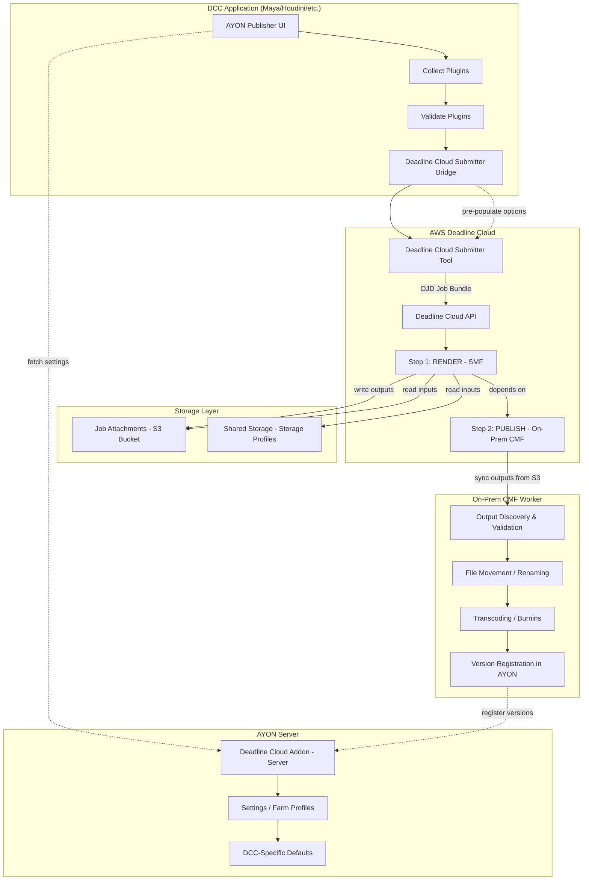
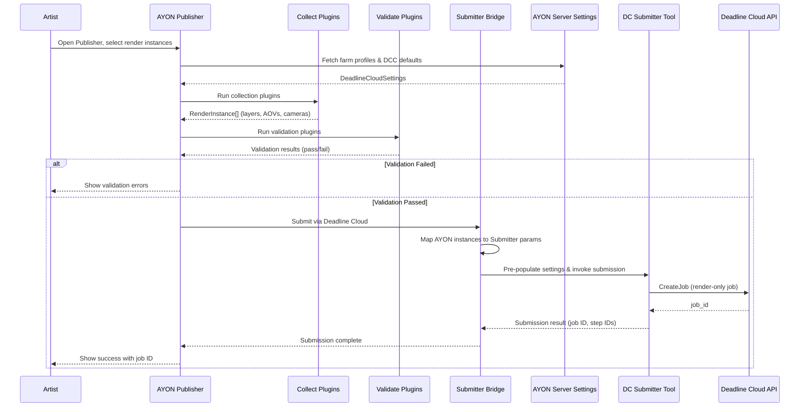
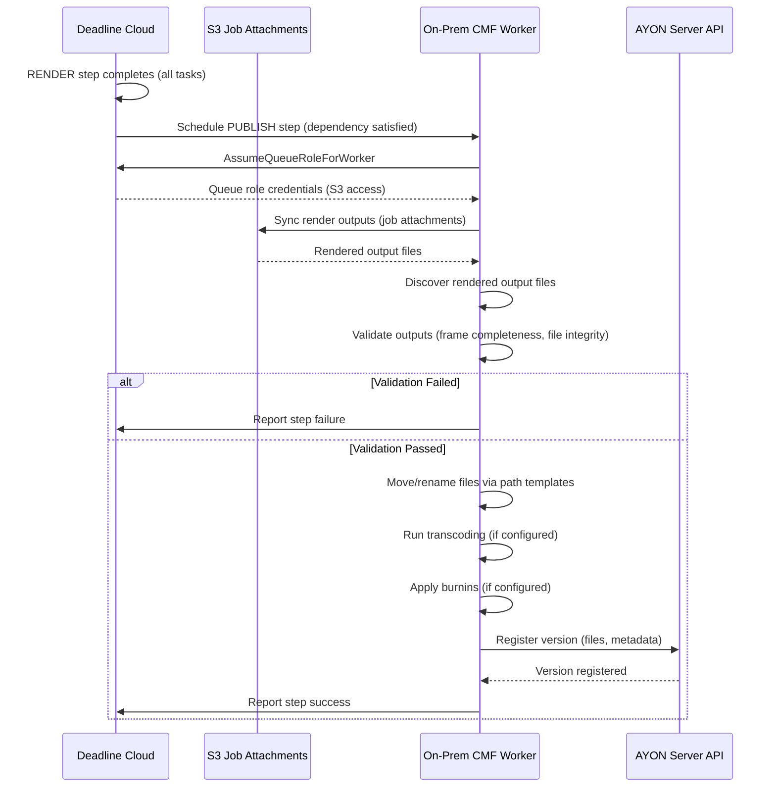
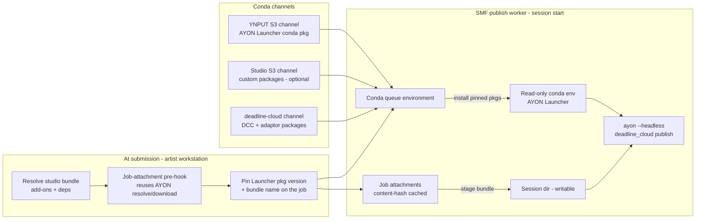
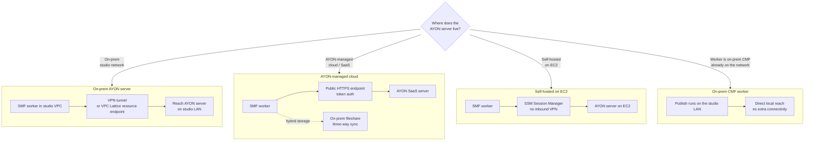
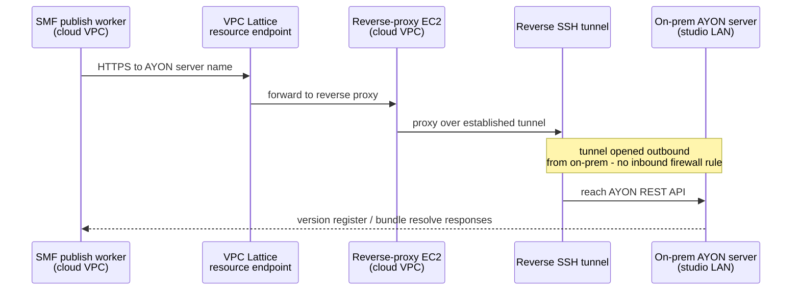

# Design Document: AYON Deadline Cloud Integration

## Overview

This design describes the integration between AYON (a VFX/animation pipeline management tool) and AWS Deadline Cloud for render farm submission. The integration follows the approach hooking AYON into the Deadline Cloud Submitter tool rather than creating job bundles directly. AYON handles pipeline concerns (validation, settings pre-population, post-render publishing) while delegating actual job submission to the native Deadline Cloud Submitter.

The addon is structured as a standard AYON server addon with a client-side component. The server side manages settings and configuration (farm profiles, DCC-specific defaults, submission parameters). The client side runs inside DCC applications (Maya, Houdini, etc.) and integrates with the AYON Publisher workflow — collecting render data, running validations, pre-populating the Deadline Cloud Submitter, and handling post-render publishing (version registration, transcoding, validation).

The key architectural principle is **separation of responsibilities**: AYON owns the pipeline (what to render, how to validate, what to do after render), while Deadline Cloud owns the execution (scheduling, resource management, job lifecycle). The integration point is the Deadline Cloud Submitter's hook/callback system, where AYON injects its pipeline logic at well-defined stages.

## MVP Scope

### In Scope (MVP)

- **Studio-configurable validations**: Pre-submission validation plugins that run before any resource-intensive operations. Includes both built-in technical validations (renderable camera exists, valid frame range) and studio-defined custom validations (required AOVs, render settings checks).
- **Publishing and processing results**: Version registration in AYON, transcoding, reviewable creation, burnins, file movement/renaming via path templates.
- **Post-render publishing on a Deadline Cloud worker**: The render job includes a PUBLISH step that runs on a Deadline Cloud worker, with a step dependency on RENDER, so the full render→publish flow stays inside a single Deadline Cloud job. Two worker shapes are in scope and share the same OJD job template:
  - **SMF publish worker** (the PoC target): a transient service-managed-fleet worker that installs the **AYON Launcher conda package** from a conda channel at session start, runs it **headless** for the publish step, and reaches the AYON server over a configured network path. See [Runtime and Bundle Distribution](#runtime-and-bundle-distribution) and [AYON Server Connectivity](#ayon-server-connectivity).
  - **On-prem CMF publish worker**: an on-prem customer-managed-fleet worker that already sits on the studio network and downloads render outputs from S3 via the Deadline Cloud credential chain (no VPN needed for S3). See [Post-Render Execution Model](#post-render-execution-model).
- **Runtime and bundle distribution to workers**: Getting the AYON runtime and the studio's bundle onto a worker so the publish step can run — the AYON Launcher as a conda package, the per-studio bundle via job attachments, and conda as the standard environment on both SMF and CMF. See [Runtime and Bundle Distribution](#runtime-and-bundle-distribution).
- **AYON server connectivity**: A network path from the publish worker to the AYON server, scoped per studio deployment shape (on-prem, AYON-managed cloud, or self-hosted on EC2). See [AYON Server Connectivity](#ayon-server-connectivity).

> **MVP alignment (2026-06-09 Dev Deep Dive — Ynput, AWS, Oehmen Digital Studio).** The publish step is being taken forward **as a PoC to build and validate**, split into two independent halves: (1) **getting AYON + the bundle onto the worker** (Launcher → conda package, owned by AWS/Leon Li; per-studio bundle via a job-attachment pre-hook, owned by Ynput/Ondřej Šamárek), and (2) **reaching the AYON server**, which varies by where the server lives. Conda is the standard environment for both SMF and CMF so a single setup is maintained. Hybrid SMF/CMF is viable but requires synchronized storage. The two new sections below capture each half; the on-prem CMF path documented later remains valid and becomes the "AYON server already on the worker's network" connectivity case. Tracking: discussion [#26](https://github.com/ynput/ayon-deadline-cloud/discussions/26).

### Deferred (Post-MVP)

- **Fully cloud-based publishing**: Once the publish worker fleet has access to the studio fileshare via VPN, Direct Connect, or FSx, the on-prem CMF can be replaced with a cloud CMF or SMF. The same OJD job template works — no changes to the AYON integration needed.
- **Advanced project tracking**: Higher-level job dependencies beyond render→publish, priority management across assets, planning integration, task status updates.
- **Asset-level dependencies**: Complex dependency graphs like "create render archives → render images → publish".
- **Cross-job orchestration**: Managing priorities and dependencies across multiple submissions.

## Architecture



> **Job structure**: A single Deadline Cloud job with two steps. The RENDER step runs on a service-managed fleet (SMF) and produces outputs as job attachments in S3. The PUBLISH step depends on RENDER and runs on an on-prem customer-managed fleet (CMF) worker. The on-prem worker downloads render outputs from S3 via the Deadline Cloud credential chain (`AssumeQueueRoleForWorker` → queue role with S3 access). No VPN is needed — all communication is outbound HTTPS.
>
> Per-step host requirements in the [OJD template](https://github.com/OpenJobDescription/openjd-specifications/wiki/2023-09-Template-Schemas) route each step to the correct fleet. Both the SMF and on-prem CMF are associated with the same queue. Custom capability attributes (e.g., `attr.worker.fleet.type`) differentiate them.
>
> **Path to fully cloud-based publishing**: Because the PUBLISH step is defined as an OpenJD template, the same job structure works when the publish fleet moves to the cloud. Once the publish fleet has fileshare access via VPN, Direct Connect, or FSx, the on-prem CMF can be replaced with a cloud CMF or SMF — no changes to the job template or AYON integration needed.

## Sequence Diagrams

### Main Submission Flow



### Post-Render Publishing Flow (On-Prem CMF Worker)



## Storage and Data Transfer

AWS Deadline Cloud provides two options for managing input and output data:

### Option 1: [Job Attachments](https://docs.aws.amazon.com/deadline-cloud/latest/developerguide/build-job-attachments.html)

Deadline Cloud transfers data to and from Cloud Workers using S3 buckets:
- **Input sync**: Scene files and assets are uploaded to S3 and synced to workers when the job starts
- **Output sync**: Rendered outputs are synced back to the workstation when the job finishes
- **Step-to-step output→input sync (how PUBLISH gets RENDER's outputs)**: Within a single job, the RENDER step's outputs are declared as job-attachment outputs and the dependent PUBLISH step declares the same locations as inputs. The Deadline Cloud worker agent syncs the previous step's session outputs down as the next step's session inputs automatically, **driven by the OpenJD job template** — no CLI download call inside the step, no cron, no separate download configuration. This is the mechanism the publish step relies on.
- **Linux VFS mount**: On Linux workers, job attachments can be mounted as a virtual filesystem for standard file access
- **Output retrieval to a workstation (separate concern)**: Getting outputs back to an artist workstation (outside the job) still uses the Deadline CLI (`deadline job download-output`) manually or on a schedule. This is **not** part of the render→publish flow — the in-job step I/O above covers publishing — so the publish step does not depend on it.

### Option 2: [Shared Storage (Storage Profiles)](https://docs.aws.amazon.com/deadline-cloud/latest/userguide/storage-profile-shared-file.html)

Uses storage profiles to remap paths between different filesystems and platforms:
- **Path remapping**: Automatically translates paths between Windows, Linux, and macOS workers
- **Existing files**: Files already on shared storage are not re-uploaded
- **Local files**: Files not on shared storage are uploaded to the job attachments S3 bucket
- **Cross-platform support**: Enables mixed-platform render farms with consistent path resolution

### Post-Render Script Access

The post-render (PUBLISH step) script accesses rendered outputs via:
1. **Job attachments (step I/O)**: The RENDER step's outputs are delivered to the PUBLISH step as that step's job-attachment **inputs**, synced into the session by the worker agent before the step script runs (declared in the job template). The script reads them from the session input location directly — **no explicit download call, no `deadline queue sync-output` cron, no extra IAM/storage-profile setup**. Encryption-at-rest in S3 is transparent here because the agent performs the sync within the job's credential context.
2. **Shared storage**: Direct filesystem access using remapped paths from storage profiles. No download step required.
3. **Hybrid**: Combination based on storage configuration — shared storage files are accessed directly, job-attachment files arrive as synced step inputs.

### Storage Configuration

The `StorageConfig` in farm profiles determines which storage method is used and how paths are resolved. See the `StorageConfig` data model below.

## Runtime and Bundle Distribution

For a worker to run the publish step it needs the AYON runtime plus the studio's bundle (the immutable set of add-on versions, settings, and dependency package the job was submitted against). On a workstation or an on-prem CMF worker this is already present. On a transient SMF worker it is not, and re-downloading hundreds of MB to GB from the AYON server on every short-lived worker is a cost and server-load problem. The 2026-06-09 alignment splits the solution into two independent artifacts plus a shared environment standard.

### What ships, and how

| Concern | Approach | Owner |
|---|---|---|
| AYON runtime on **all worker types (SMF + CMF + on-prem)** | A **full AYON Launcher conda package** built from the [ayon-launcher hatch build](https://github.com/ynput/ayon-launcher/pull/303) and packaged as a Deadline Cloud conda package (platform-specific `linux-64` + `win-64`, ~800 MB–1 GB). Installed from a conda channel by the queue's conda environment at session start; **run headless** on SMF publish workers (`ayon --headless …`) and used the same package on CMF/on-prem/workstation (where it can also drive the GUI). Immutable, never self-updates on a worker. First version: [aws-deadline/deadline-cloud-samples#237](https://github.com/aws-deadline/deadline-cloud-samples/pull/237) — verified on Linux + Windows SMF workers. | AWS (Leon Li) |
| Per-studio **bundle** (add-ons + deps, a few hundred MB) | Shipped as **job-attachment inputs** by a pre-submission hook that reuses the same AYON resolve/download functions the Launcher already uses to fetch a bundle. First submit uploads; later submits hit the **content-hash cache**, so they are fast. AYON env vars point the runtime at the cached files wherever they land (S3, fileshare, mount). | Ynput (Ondřej Šamárek) |
| Environment standard | **Conda on both SMF and CMF**, so a single environment setup is maintained rather than two. | Shared |

Full reasoning, the rejected "ship the full cx_Freeze launcher to SMF" option, the conda-immutability and auto-update-determinism arguments, and the SMF privilege model are in [`launcher-distribution.md`](./launcher-distribution.md). **Note:** that doc's working-notes conclusion favored a *separate slim headless `ayon-publish` package* for SMF; the 2026-06-09 call and PR #237 instead landed on packaging the **full Launcher** as a conda package and running it headless on SMF (simpler — one artifact for all fleet types, bundle handled separately via job attachments). The headless-package option is retained there as superseded rationale. The key decision holds: **render-farm workers pin the runtime + addon versions at submission time and never self-update mid-job** — the Launcher conda package version (plus the bundle name) is the pin.

### Distribution flow



> **Infrastructure dependency.** SMF publish workers install the AYON Launcher conda package (and any custom packages) from S3-backed conda channels, so the **queue role must allow `s3:GetObject` / `s3:ListBucket` on those channel buckets** — including the YNPUT-owned channel, which is a **remote (cross-account) bucket today and is expected to become public-read soon**. Provisioning that access (alongside the conda queue environment, VPC egress, and the connectivity path below) is the [terraform-modules-studio-infra](https://github.com/oehmen/terraform-modules-studio-infra) deployment work scoped separately.

## AYON Server Connectivity

Distributing the runtime and the bundle (above) is independent from the publish worker **reaching the AYON server** to register versions and pull what it needs. The on-prem CMF path solves this implicitly — the worker already sits on the studio network. An SMF publish worker does not, so the connectivity path depends on **where the AYON server lives**. Three deployment shapes cover the field; cover all, validate the most probable first.



| Scenario | Server location | Connectivity mechanism | Notes |
|---|---|---|---|
| **A. On-prem AYON server** | Studio datacenter / LAN | **VPN** (site-to-site / client) **or VPC Lattice** resource endpoint to the on-prem service | Most common for established studios. A working PoC exists (below). |
| **B. AYON-managed cloud** | Ynput-managed SaaS | **Public HTTPS endpoint** with token auth — no tunnel needed for the server connection | For hybrid storage, an on-prem fileshare joins as a three-way setup; do not move the full job-attachment payload over the server link. |
| **C. Self-hosted on EC2** | Studio's own AWS account | **SSM Session Manager** instead of a VPN — outbound-only, no inbound listener or bastion | Lowest-friction cloud-to-cloud path when the studio already runs AYON on EC2. |
| **D. On-prem CMF worker** | Any (worker is on the LAN) | **Direct local reach** — the publish worker is already on the studio network | This is the existing on-prem CMF design; connectivity is implicit. |

### Validated PoC — SMF worker → on-prem AYON server (Scenario A)

A working proof of concept for the SMF→on-prem case has been built and validated (kept locally; it contains account IDs and instance details and is **not committed**). The publish worker in the cloud VPC reaches an on-prem AYON server through a **VPC Lattice resource endpoint** fronting an **EC2 reverse proxy**, which carries the connection to the studio over a **reverse SSH tunnel**. The shape is below; concrete IDs/IPs are intentionally omitted.



Key properties: the tunnel is established **outbound from on-prem**, so the studio opens no inbound firewall rule; VPC Lattice gives the worker a stable in-VPC endpoint decoupled from the proxy's address; and the path carries only the AYON **server** connection (REST/auth), not the bulk job-attachment payload — that still flows worker↔S3 per [Runtime and Bundle Distribution](#runtime-and-bundle-distribution).

### Hybrid SMF/CMF note

Hybrid SMF/CMF (on-prem CMF baseline, SMF for scale-out) is viable and increasingly common for distributed studios, **but only with synchronized storage**. Without it, on-prem workers pull the whole payload from cloud S3, which becomes the bottleneck. VPN / VPC Lattice / SSM are for the **AYON-server connection**, not for moving the full job-attachment payload.

### Open questions

1. Which connectivity scenario is the primary MVP validation target beyond the Scenario A PoC — confirm the most probable studio shape first.
2. For Scenario A, VPN vs VPC Lattice as the recommended default, and what the studio-side prerequisites are for each.
3. How the chosen connectivity path is provisioned and parameterized in [terraform-modules-studio-infra](https://github.com/oehmen/terraform-modules-studio-infra) (VPC Lattice resource config, egress, queue-role S3 access for the conda channels).

## Components and Interfaces

### Component 1: Server Settings (`server/settings.py`)

**Purpose**: Define all configurable settings for the addon — farm profiles, DCC defaults, submission parameters, and post-render options. Served to client via AYON server API.

```python
class FarmProfile(BaseSettingsModel):
    """A named farm configuration profile."""
    name: str
    farm_id: str
    queue_id: str
    storage_profile_id: str | None = None
    storage_config: StorageConfig = StorageConfig(storage_mode="job_attachments")
    priority: int = 50
    max_retries: int = 3

class DCCSubmissionDefaults(BaseSettingsModel):
    """Per-DCC default submission parameters."""
    dcc_name: str  # "maya", "houdini", etc.
    job_template: str | None = None
    parameter_overrides: dict[str, Any] = {}

class PostRenderSettings(BaseSettingsModel):
    """Configuration for post-render processing."""
    enable_transcoding: bool = False
    transcode_profiles: list[TranscodeProfile] = []
    burnin_config: BurninConfig = BurninConfig()
    validate_frame_completeness: bool = True
    validate_file_integrity: bool = True

class HostRequirements(BaseSettingsModel):
    """Hardware/OS requirements for Deadline Cloud worker hosts.
    
    Overrides the host requirements in the Deadline Cloud Submitter's
    job settings. When set, these values are injected into the OJD
    template's hostRequirements section, replacing the submitter defaults.
    All fields are optional — only non-None values override the submitter.
    
    OJD mapping:
    - os_family → attributes: [{name: "attr.worker.os.family", anyOf: [value]}]
    - cpu_arch → attributes: [{name: "attr.worker.cpu.arch", anyOf: [value]}]
    - min/max_vcpu → amounts: [{name: "amount.worker.vcpu", min/max: value}]
    - min/max_memory_mib → amounts: [{name: "amount.worker.memory", min/max: value}]
    - min/max_gpu → amounts: [{name: "amount.worker.gpu", min/max: value}]
    - min/max_gpu_memory_mib → amounts: [{name: "amount.worker.gpu.memory", min/max: value}]
    """
    os_family: str | None = None           # "linux", "windows", "macos"
    cpu_arch: str | None = None            # "x86_64", "arm64"
    min_vcpu: int | None = None            # Minimum vCPUs
    max_vcpu: int | None = None            # Maximum vCPUs
    min_memory_mib: int | None = None      # Minimum memory in MiB
    max_memory_mib: int | None = None      # Maximum memory in MiB
    min_gpu: int | None = None             # Minimum GPU count
    max_gpu: int | None = None             # Maximum GPU count
    min_gpu_memory_mib: int | None = None  # Minimum GPU memory in MiB (per-GPU lower bound)
    max_gpu_memory_mib: int | None = None  # Maximum GPU memory in MiB (per-GPU lower bound)

class CondaPackage(BaseSettingsModel):
    """A single conda package specification."""
    name: str                  # e.g., "maya", "maya-openjd", "maya-vray"
    version: str               # Explicit version spec (e.g., "2026.*"), or "auto" to use installed version from artist machine, or "" for latest

class DCCCondaConfig(BaseSettingsModel):
    """Per-DCC conda package and channel configuration for farm workers.
    
    Each DCC has its own combination of conda packages (DCC app, OpenJD
    adaptor, renderer, etc.). This model defines the packages for a
    single DCC application.
    
    Overrides the default auto-detection behavior of the Deadline Cloud
    DCC submitters (e.g., deadline-cloud-for-maya), allowing studios to
    pin specific package versions from AYON server settings.
    
    Override model (follows AYON's standard settings override pattern):
    - project settings → server settings → auto-detection
    - Auto-detection is the default out of the box. If no settings are
      configured at any level, the native submitter behavior is preserved.
    - TDs only need to configure when they want explicit control.
    
    Channel behavior:
    - By default the `deadline-cloud` channel is used implicitly by the
      native submitter.
    - As soon as custom_packages are added, channels must be defined
      explicitly — either both `deadline-cloud` and the custom S3 channel
      (e.g., `s3://my-studio-conda-123456789-us-west-2/Conda/Default`)
      if standard AWS packages are still needed, or only the S3 channel
      if everything including the adaptor is packaged custom.
    """
    dcc_name: str              # "maya", "houdini", etc.
    packages: list[CondaPackage] = []  # Standard DCC packages, e.g., [{"name": "maya", "version": "2026.*"}, {"name": "maya-openjd", "version": "auto"}, {"name": "maya-vray", "version": ""}]
    custom_packages: list[CondaPackage] = []  # Studio-specific custom conda packages (proprietary tools, plugins, internal libraries)
    channels: list[str] = []   # Conda channels. Empty = use default `deadline-cloud` channel implicitly. Must be set explicitly when custom_packages are used.

class QueueConfig(BaseSettingsModel):
    """A named Deadline Cloud queue."""
    name: str                  # Display name
    queue_id: str              # AWS queue ID
    farm_id: str               # Associated farm ID
    description: str = ""

class DeadlineCloudSettings(BaseSettingsModel):
    """Root settings model for the addon."""
    farm_profiles: list[FarmProfile] = []
    default_profile: str = ""
    available_queues: list[QueueConfig] = []   # All available queues defined at server level
    default_queue_id: str = ""                 # Server-level default queue
    dcc_conda_configs: list[DCCCondaConfig] = []  # Per-DCC conda package/channel configuration
    host_requirements: HostRequirements = HostRequirements()  # Worker host hardware/OS overrides
    dcc_defaults: list[DCCSubmissionDefaults] = []
    post_render: PostRenderSettings = PostRenderSettings()
    custom_validations: list[CustomValidation] = []
    auto_detect_credentials: bool = True

class ProjectDeadlineCloudSettings(BaseSettingsModel):
    """Per-project overrides for Deadline Cloud settings.
    
    Follows AYON's standard settings override model: studio defaults
    apply everywhere, projects only override when needed. Empty/default
    values inherit from server settings.
    """
    default_queue_id: str = ""  # Project-level override; empty = use server default
    dcc_conda_configs: list[DCCCondaConfig] = []  # Project-level per-DCC conda overrides; empty = use server defaults

class CustomValidation(BaseSettingsModel):
    """Studio-configurable validation rule."""
    name: str
    enabled: bool = True
    dcc_scope: list[str] = []  # Empty = all DCCs, or ["maya", "houdini"]
    validation_type: str       # "required_aovs", "render_settings", "custom_script"
    parameters: dict[str, Any] = {}
    error_message: str = ""
```

**Responsibilities**:
- Store farm connection details (farm ID, queue ID, storage profiles)
- Define per-DCC submission defaults and job template overrides
- Configure post-render pipeline behavior (transcoding, validation)
- Provide sensible defaults for all settings

### Component 2: Render Instance Collector (`client/plugins/collect_render.py`)

**Purpose**: Collect render-related data from the DCC scene — render layers, AOVs, cameras, frame ranges — and package them as AYON instances for the publish pipeline.

```python
class CollectedRenderInstance:
    """Data collected from a DCC scene for a single render unit."""
    instance_name: str
    render_layer: str
    aovs: list[str]
    cameras: list[str]
    frame_range: tuple[int, int]
    frame_step: int
    scene_file: str
    output_dir: str
    expected_files: list[str]
    dcc_specific_data: dict[str, Any]
```

**Responsibilities**:
- Query DCC scene for renderable items (layers, ROPs, write nodes)
- Resolve output paths using AYON anatomy templates
- Calculate expected output file lists for post-render validation
- Package DCC-specific data needed by the submitter

### Component 3: Submitter Bridge (`client/plugins/submit_to_deadline_cloud.py`)

**Purpose**: Bridge between AYON's publish pipeline and the Deadline Cloud Submitter tool. Maps AYON render instances to Submitter parameters, pre-populates settings, and invokes submission. The Submitter collects scene data, presents them in its UI, and creates an Open Job Description (OJD) job bundle — a grouped OJD template with asset references, parameter values, and additional files needed by the job. The job bundle is then submitted via the Deadline Cloud Python API.

> **Forward-looking — unified submitter API.** Today the bridge reaches the per-DCC submitter functions through AYON's forked submitters. AWS has posted a first-version [unified submitter API design](https://github.com/ynput/ayon-deadline-cloud/discussions/17#discussioncomment-17272843) (discussion [#17](https://github.com/ynput/ayon-deadline-cloud/discussions/17)): an abstract `SubmitterAPI` (with `get_submission_context()`), a `SubmitterSettings` base dataclass, a frozen `SubmissionContext`, and a `get_submitter_api(host_name)` factory, all in the shared `deadline-cloud` library and DCC-agnostic/headless. Once available, this bridge should consume `get_submitter_api(...).get_submission_context()` instead of importing forked submitter modules — retiring the per-DCC forks. This is tracked as the secondary (post-publish) workstream and does not change the data this component produces.

```python
class SubmitterBridge:
    """Bridges AYON publish data to Deadline Cloud Submitter."""

    def map_instance_to_params(
        self,
        instance: CollectedRenderInstance,
        settings: DeadlineCloudSettings,
    ) -> SubmissionParams: ...

    def pre_populate_submitter(
        self,
        submitter: Any,  # DC Submitter tool handle
        params: SubmissionParams,
    ) -> None: ...

    def submit(
        self,
        instances: list[CollectedRenderInstance],
        settings: DeadlineCloudSettings,
    ) -> SubmissionResult: ...

    def _get_parameter_values(
        self,
        instance: CollectedRenderInstance,
        settings: DeadlineCloudSettings,
    ) -> dict[str, Any]:
        """Build parameter values for the OJD template.

        Overrides the native submitter's auto-detected conda packages
        with AYON-configured values. Specifically, this populates the
        `CondaPackages` and `RezPackages` shared parameter values that
        are passed to `SubmitJobToDeadlineDialog`.

        If a DCCCondaConfig exists for the active DCC, those packages
        replace the auto-detected values (e.g., the default
        `conda_packages = f"maya={maya_version}.* maya-openjd={adaptor_version}.*"`
        from deadline-cloud-for-maya).

        For packages with version="auto", the installed version from the
        artist's machine is resolved at submission time.
        """
        ...

    def _resolve_conda_packages(
        self,
        dcc_name: str,
        server_settings: DeadlineCloudSettings,
        project_settings: ProjectDeadlineCloudSettings | None,
        dcc_context: dict[str, Any],
    ) -> str:
        """Resolve conda package string from AYON settings for a specific DCC.

        Looks up the DCCCondaConfig for the active DCC, following the
        override chain: project → server → auto-detection.

        Builds the conda package specification string by combining
        standard packages and custom packages with version resolution:
        - Explicit versions are used as-is (e.g., "maya=2026.*")
        - "auto" versions are resolved from the artist's installed DCC
        - Empty versions use latest (e.g., "maya-vray")

        Returns a space-separated package string compatible with the
        Deadline Cloud submitter's CondaPackages parameter.
        """
        ...

    def _resolve_queue_id(
        self,
        settings: DeadlineCloudSettings,
        project_settings: ProjectDeadlineCloudSettings | None,
        instance_override: str | None = None,
    ) -> str:
        """Resolve which queue ID to use for submission.

        Priority order:
        1. Instance-level override (if provided)
        2. Project default queue (from project settings)
        3. Server default queue (from server settings)
        4. First available queue (fallback)
        """
        ...

    def _resolve_host_requirements(
        self,
        host_req: HostRequirements,
    ) -> dict[str, Any] | None:
        """Resolve host requirements from AYON settings into OJD format.

        Converts non-None fields from HostRequirements into the
        hostRequirements dict expected by the OJD template. Only
        fields explicitly set in AYON settings are included — unset
        fields fall through to the submitter's defaults.

        Returns None if no fields are set (submitter defaults preserved).
        """
        ...
```

#### Conda Package Override Behavior

The native Deadline Cloud DCC submitters (e.g., `deadline-cloud-for-maya`) auto-detect the DCC version and pull the latest compatible conda packages automatically. For example, the Maya submitter builds:
```python
conda_packages = f"maya={maya_version}.* maya-openjd={adaptor_version}.*"
```

The AYON integration overrides this behavior when a `DCCCondaConfig` is configured for the active DCC in server or project settings. AYON's settings take precedence over the auto-detected values. This is an intentional design decision — studios need version pinning control for reproducibility and stability on the farm.

Conda packages are defined **per DCC**. Each DCC has its own combination of packages — Maya needs `maya`, `maya-openjd`, and a renderer package like `maya-vray`; Houdini would need `houdini`, `houdini-openjd`, etc. The settings structure reflects this so TDs configure packages for each DCC independently.

**Override resolution chain** (follows AYON's standard [settings override model](https://help.ayon.app/help/articles/8317800-working-with-settings)):

**project `dcc_conda_configs` → server `dcc_conda_configs` → auto-detection**

Auto-detection is the default out of the box. If no settings are configured at any level, the native submitter behavior is preserved. Studios can start using the integration without configuring any conda settings. TDs only step in to pin versions when they need explicit control. A TD sets `maya-vray=*` (latest) at the studio level once. If a specific project needs to stay on VRay 6.x, they override just that project. No need to configure every project individually.

Key override rules:
- If a `DCCCondaConfig` exists for the active DCC (at project or server level), AYON builds the `CondaPackages` parameter value from settings instead of using auto-detection
- Project-level `dcc_conda_configs` take precedence over server-level for the same DCC
- `CondaPackages` and `CondaChannels` are [queue environment parameters](https://docs.aws.amazon.com/deadline-cloud/latest/userguide/create-queue-environment.html) — the default conda queue environment adds these as job parameters at submission time. The submitter populates them based on the DCC application. AYON overrides these parameter values before submission.
- For packages with `version="auto"`, the version depends on what's installed on the artist's machine — this allows the adaptor version to track the artist's local installation while still being explicitly controllable
- If no `DCCCondaConfig` exists for the active DCC at any level, the native submitter's auto-detection behavior is preserved (backward compatible)

**Custom conda packages and channels:**

The `custom_packages` field on `DCCCondaConfig` allows TDs to add studio-specific conda packages beyond the standard DCC/renderer/adaptor set (proprietary tools, custom plugins, internal libraries).

When custom packages are used, channels must be defined explicitly. By default the `deadline-cloud` channel is used implicitly by the native submitter. As soon as custom packages are added, the `channels` field must be set — either both `deadline-cloud` and the custom S3 channel (e.g., `s3://my-studio-conda-123456789-us-west-2/Conda/Default`) if standard AWS packages are still needed, or only the S3 channel if everything including the adaptor is packaged custom.

**Publisher UI visibility:**

The resolved conda packages (from the override chain) are displayed as editable fields on the render instance in the AYON Publisher UI. This lets artists adjust packages before submitting (e.g., testing a different renderer version) without needing TD access to server settings. Whatever they set still goes through the publish validation step before submission, so invalid or unsupported packages are caught before reaching the farm. Central conda config acts as a form of human validation — TDs explicitly define what runs on the farm rather than relying on auto-detection.

> **Current implementation note**: PR #5 implements a simpler version of this — an "Extra Conda Packages" text field that appends to the resolved packages. The full design calls for displaying and editing the complete resolved package list, not just appending extras. The current auto-detection logic in `environment.py` is already per-host (`_get_conda_pkgs_for_maya`), which aligns with the per-DCC `DCCCondaConfig` model. The implementation needs to evolve from flat string settings to the structured per-DCC model with project-level overrides.

> **Integration Consideration**: Enabling per-DCC conda config in AYON settings will suppress the native submitter's built-in version resolution for that DCC. Studios should be aware that this requires coordination between AYON addon updates and Deadline Cloud submitter updates.

> **Conda Version Pinning**: AWS recommends pinning to major.minor versions only (e.g., `maya=2026`, not `maya=2026.1`), because patch releases replace previous packages on the `deadline-cloud` channel. Pinning to a specific patch version will cause submissions to fail when that patch is superseded. The AYON settings UI should guide studios toward this best practice. See [Default conda queue environment](https://docs.aws.amazon.com/deadline-cloud/latest/userguide/create-queue-environment.html) for the full list of available packages and pinning guidance.

#### Queue Resolution

Queue selection follows a priority chain:
1. **Instance-level override**: Explicit queue set on a specific render instance
2. **Project default queue**: `ProjectDeadlineCloudSettings.default_queue_id` for the current AYON project
3. **Server default queue**: `DeadlineCloudSettings.default_queue_id`
4. **First available queue**: Falls back to the first entry in `DeadlineCloudSettings.available_queues`

This allows studios to define all available queues centrally, set a global default, and let individual projects override as needed.

#### Host Requirements Override Behavior

The native Deadline Cloud Submitter exposes host requirements in its [Host requirements tab](https://docs.aws.amazon.com/deadline-cloud/latest/userguide/jobs-using-submitter.html) (OS family, vCPU, memory, GPU). The AYON integration allows studios to override these from server settings via `HostRequirements`.

Key override rules:
- Only non-None fields in `HostRequirements` override the submitter's values — unset fields preserve the submitter's defaults or artist's manual selections
- This is a partial override model: studios can pin OS family and GPU requirements while leaving CPU/memory to the submitter defaults
- Host requirements are injected into the OJD template's [`hostRequirements` section](https://github.com/OpenJobDescription/openjd-specifications/wiki/2023-09-Template-Schemas) before submission. The OJD spec defines standard amount capabilities (`amount.worker.vcpu`, `amount.worker.memory`, `amount.worker.gpu`, `amount.worker.gpu.memory`) and attribute capabilities (`attr.worker.os.family`). See [Schedule jobs — Determine fleet compatibility](https://docs.aws.amazon.com/deadline-cloud/latest/developerguide/build-jobs-scheduling.html) for how host requirements interact with fleet capabilities.
- If all fields are None (default), the submitter's host requirements are preserved entirely (backward compatible)

> **Integration Consideration**: Host requirements interact with Deadline Cloud's fleet configuration. Studios should ensure that the configured requirements match available fleet capacity — e.g., requesting GPU workers when no GPU fleet is provisioned will cause jobs to remain queued indefinitely.

**Responsibilities**:
- Translate AYON render instances into Deadline Cloud Submitter parameters
- Pre-populate the Submitter with AYON settings before submission
- Attach post-render step configuration to the submission
- Return job ID and step IDs back to the AYON publish pipeline
- Support job progress monitoring via the Deadline Cloud API (`GetJob`, `SearchSteps`, `SearchTasks`)

### Component 4: Validation Plugins (`client/plugins/validate_*.py`)

**Purpose**: Run AYON-specific validations on collected render data before submission. These run within the AYON Publisher pipeline, before the Submitter is invoked. Validations are critical for farm rendering (especially cloud) to prevent wasting resources on jobs that would fail.

**Validation Categories**:
- **Technical validations** (built-in): Renderable camera exists, valid output paths, scene file integrity
- **Project-context validations** (built-in): Frame range matches AYON context, correct folder/task assignment
- **Studio-configurable validations** (custom): Required render elements/AOVs present, specific render settings enforced, naming conventions, resolution checks — defined per-studio via settings

```python
class ValidateFrameRange:
    """Ensure frame range is valid and matches AYON context."""
    def process(self, instance: CollectedRenderInstance) -> None: ...

class ValidateOutputPaths:
    """Ensure output paths are resolvable and writable."""
    def process(self, instance: CollectedRenderInstance) -> None: ...

class ValidateSceneIntegrity:
    """DCC-specific scene checks before farm submission."""
    def process(self, instance: CollectedRenderInstance) -> None: ...

class ValidateRenderElements:
    """Studio-configurable: Check required AOVs/render elements are present."""
    def process(self, instance: CollectedRenderInstance) -> None: ...

class ValidateRenderSettings:
    """Studio-configurable: Enforce specific render settings (resolution, sampling, etc.)."""
    def process(self, instance: CollectedRenderInstance) -> None: ...

class ValidateCondaPackages:
    """Validate resolved conda packages before submission.
    
    Checks that the conda package string is well-formed and that
    channels are defined when custom packages are present. This
    validation also runs when artists edit packages in the Publisher UI.
    """
    def process(self, instance: CollectedRenderInstance) -> None: ...
```

**Responsibilities**:
- Validate frame ranges match AYON asset context
- Verify output paths are resolvable via anatomy templates
- Run DCC-specific scene integrity checks
- Execute studio-defined custom validations from settings
- Block submission if any validation fails (with actionable error messages)

### Component 5: Post-Render Script (`client/scripts/post_render.py`)

#### Post-Render Execution Model

**Hybrid SMF + on-prem CMF approach.** The render job is a single Deadline Cloud job with two steps. The RENDER step runs on a service-managed fleet (cloud). The PUBLISH step runs on an on-prem customer-managed fleet worker, with a step dependency on RENDER. The on-prem worker downloads render outputs from S3 via the Deadline Cloud credential chain and runs the publish pipeline locally (transcoding, burnins, file movement, AYON version registration).

This keeps the full render→publish flow within a single Deadline Cloud job — no external orchestration, no cron jobs, no separate AYON service. The job either succeeds (render + publish) or fails with full visibility in the Deadline Cloud Monitor.

**Per-step fleet routing.** The [OJD spec](https://github.com/OpenJobDescription/openjd-specifications/wiki/2023-09-Template-Schemas) defines `hostRequirements` at the step level. Each step can target a different fleet via custom capability attributes (e.g., `attr.worker.fleet.type` = `"smf-render"` vs `"cmf-publish"`). Both fleets are associated with the same queue. From the [AWS docs](https://docs.aws.amazon.com/deadline-cloud/latest/userguide/jobs-processing.html): "The fleet is chosen based on the capabilities configured for the fleet and the host requirements of a specific step."

**Submission hooks for job template assembly.** The [submission hooks feature](https://github.com/aws-deadline/deadline-cloud/pull/986) (`hooks.yaml` in job bundles or via `DEADLINE_HOOKS_DIR`) can inject the PUBLISH step into the OJD template at submission time. A pre-submission hook adds the PUBLISH step with the correct `hostRequirements`, `dependsOn`, and AYON context metadata. AYON's pre-launch hook sets `DEADLINE_HOOKS_DIR` to point to AYON-managed hook scripts, so this applies to all submissions without modifying job bundles.

**On-prem worker S3 access (no VPN needed).** The on-prem worker accesses S3 job attachments through the Deadline Cloud credential chain:
1. Worker bootstraps with `AWSDeadlineCloud-WorkerHost` credentials via [IAM Roles Anywhere](https://docs.aws.amazon.com/rolesanywhere/latest/userguide/introduction.html) (certificate-based, recommended for production) or IAM user access keys (for testing)
2. Worker calls `AssumeFleetRoleForWorker` → fleet role credentials (auto-refreshed)
3. When processing the PUBLISH step, worker calls `AssumeQueueRoleForWorker` → queue role credentials with S3 `GetObject`/`PutObject` on the job attachments bucket
4. Worker agent syncs render outputs from S3 before the step script runs

All communication is outbound HTTPS (port 443) to: `scheduling.deadline.{region}.amazonaws.com`, `s3.{region}.amazonaws.com`, `logs.{region}.amazonaws.com`. No inbound connections. IAM Identity Center is not suitable here — it's for interactive human users, not headless worker agents.

**On-prem worker prerequisites:**
- [Deadline Cloud worker agent](https://github.com/aws-deadline/deadline-cloud-worker-agent) installed
- IAM Roles Anywhere trust anchor configured (or IAM user keys for testing)
- Software dependencies: ffmpeg, OIIO, lightweight AYON publish runner. These can be packaged as conda packages and installed at step runtime via the conda queue environment — the same mechanism used for DCC packages on the render step. This means publish workers don't need all dependencies pre-installed, and studios can scale to multiple on-prem worker nodes without managing software on each one individually.
- Network: outbound HTTPS to AWS endpoints + access to AYON server on the studio network

**Path to fully cloud-based publishing.** Because the PUBLISH step is defined as an OpenJD template, the same job structure works when the publish fleet moves to the cloud. Once the publish fleet has fileshare access via VPN, Direct Connect, or FSx, the on-prem CMF can be replaced with a cloud CMF or SMF — no changes to the job template or AYON integration needed.

**Trade-offs:**

| | On-prem publish (external) | Hybrid on-prem CMF (this design) | Fully cloud-based (post-MVP) |
|---|---|---|---|
| Compute | Local machine / AYON service | On-prem CMF worker(s) | Cloud CMF or SMF workers |
| Orchestration | External (cron/trigger) | Within DLC job | Within DLC job |
| VPN needed | No | No | Yes (for fileshare access) |
| AYON deps | Already local | Local or via conda | Must be packaged (conda/AMI) |
| Latency | Download first, then process | S3 sync only | Immediate (fileshare access) |
| DLC job tracking | Separate | Full visibility | Full visibility |
| Scalability | Single machine | Multiple CMF workers | Scales with farm |
| Setup | Service/cron infra | CMF fleet + IAM Roles Anywhere | + VPN/Direct Connect/FSx |

**Open questions:**
- **IAM Roles Anywhere setup complexity**: For studios without an existing PKI/CA, setting up IAM Roles Anywhere adds infrastructure overhead. AWS Private CA is an option but has cost implications. For smaller studios, time-bound IAM user keys may be the pragmatic starting point.

> **Resolved — job-attachment sync between steps.** Earlier this was an open question. The design now relies on the worker agent syncing the RENDER step's session outputs as the PUBLISH step's session inputs automatically, declared in the OpenJD job template (step output → dependent step input). The PUBLISH step does **not** call `deadline job download-output`, and **no** `deadline queue sync-output` automatic-download configuration is required. See [Storage and Data Transfer](#storage-and-data-transfer).

**Purpose**: Handles output validation, transcoding, burnin application, and version registration in AYON after rendering completes. May run as a Deadline Cloud dependent step (on farm) or locally within the AYON pipeline (see TBD above).

**Publishing Process**:
Publishing is the process where a version is registered in AYON. Beyond registration, various operations run during publishing:
- **File movement/renaming**: Locally produced data is moved and renamed to final destinations controlled by AYON path templates (anatomy)
- **Remote data integration**: Data produced outside (e.g., cloud renders) can be directly integrated to final destinations from their online locations, or first downloaded then processed
- **Transcoding**: Convert formats (e.g., EXR → JPEG for review)
- **Burnin application**: Add frame numbers, shot info, and other metadata overlays to review media
- **Additional validations**: Post-render checks on output quality and completeness

```python
class PostRenderProcessor:
    """Handles post-render pipeline on the farm."""

    def resolve_output_inputs(
        self, config: PostRenderConfig
    ) -> list[str]:
        """Resolve the RENDER outputs that were synced into this step.

        In the single-job RENDER→PUBLISH model the worker agent syncs the
        RENDER step's session outputs down as this (PUBLISH) step's session
        inputs before the script runs, driven by the OpenJD job template.
        This method just resolves their local session-input path(s) — there
        is no CLI download (`deadline job download-output`) and no
        `deadline queue sync-output` cron involved.

        For shared storage mode it returns the remapped paths directly
        (files already accessible). For job-attachments mode it returns the
        synced session-input location.

        Returns the local file paths of the accessible outputs.
        """
        ...

    def discover_outputs(
        self, expected_files: list[str]
    ) -> list[str]: ...

    def validate_outputs(
        self, discovered: list[str], expected: list[str]
    ) -> ValidationResult: ...

    def transcode(
        self, files: list[str], profile: TranscodeProfile
    ) -> list[str]: ...

    def apply_burnins(
        self, files: list[str], burnin_config: BurninConfig
    ) -> list[str]: ...

    def move_to_final_destination(
        self, files: list[str], anatomy_templates: dict
    ) -> list[str]: ...

    def register_version(
        self, files: list[str], metadata: dict[str, Any]
    ) -> str: ...
```

**Responsibilities**:
- Discover and validate rendered output files (frame completeness, file integrity)
- Move/rename files to final destinations using AYON anatomy path templates
- Run transcoding if configured (e.g., EXR → JPEG for review)
- Apply burnins to review media (frame numbers, shot info, custom text)
- Register the rendered version in AYON (files, representations, metadata)
- Report success/failure back to Deadline Cloud

## Data Models

### SubmissionParams

```python
@dataclass
class SubmissionParams:
    """Parameters mapped from AYON instance to DC Submitter format."""
    job_name: str
    farm_id: str
    queue_id: str
    priority: int
    frame_range: str          # "1-100" format for DC
    scene_file: str
    output_dir: str
    job_template: str | None  # OJD template name
    job_bundle_dir: str | None  # Path to assembled OJD job bundle
    parameter_values: dict[str, Any]  # Parameter values for the OJD template
    conda_packages: str | None  # Resolved conda package string (overrides auto-detection if set)
    conda_channels: list[str] | None  # Custom conda channels (overrides defaults if set)
    host_requirements: dict[str, Any] | None  # Resolved host requirements (overrides submitter defaults if set)
    storage_profile_id: str | None
    storage_config: StorageConfig | None
    max_retries: int
    post_render_config: PostRenderConfig
```

**Validation Rules**:
- `job_name` must be non-empty and contain only alphanumeric, dash, underscore
- `farm_id` and `queue_id` must be valid AWS resource identifiers
- `priority` must be between 0 and 100
- `frame_range` must match pattern `\d+(-\d+)?`
- `scene_file` must be an existing file path
- `post_render_config` must be present

### PostRenderConfig

```python
@dataclass
class PostRenderConfig:
    """Configuration passed to the post-render step."""
    ayon_project: str
    ayon_folder_path: str
    ayon_task: str
    ayon_product_name: str
    expected_files: list[str]
    representations: list[RepresentationConfig]
    transcode_profiles: list[TranscodeProfile]
    burnin_config: BurninConfig
    anatomy_templates: dict[str, str]  # Path templates for file movement/renaming
    storage_config: StorageConfig      # How to access rendered outputs
    ayon_server_url: str
    # Credentials handled via Deadline Cloud's secret management
```

**Validation Rules**:
- `ayon_project`, `ayon_folder_path`, `ayon_task` must be non-empty
- `expected_files` must contain at least one entry
- `representations` must contain at least one entry
- `ayon_server_url` must be a valid URL

### SubmissionResult

```python
@dataclass
class SubmissionResult:
    """Result returned after submitting to Deadline Cloud."""
    success: bool
    job_id: str | None                     # Render job ID
    error_message: str | None = None
    submitted_instances: list[str] = field(default_factory=list)
```

### TranscodeProfile

```python
@dataclass
class TranscodeProfile:
    """Defines a transcoding operation for post-render."""
    name: str
    input_extension: str       # e.g., ".exr"
    output_extension: str      # e.g., ".jpg"
    ffmpeg_args: list[str]     # Additional ffmpeg arguments
    create_representation: bool = True
```

### StorageConfig

```python
@dataclass
class StorageConfig:
    """Configuration for storage and data transfer."""
    storage_mode: str          # "job_attachments", "shared_storage", or "hybrid"
    storage_profile_id: str | None = None
    s3_bucket_name: str | None = None
    
    # Path mappings for cross-platform support
    path_mappings: list[PathMapping] = field(default_factory=list)
    
    # Job attachments settings
    auto_sync_inputs: bool = True
    auto_sync_outputs: bool = True
    use_vfs_on_linux: bool = False

    # Workstation output-retrieval (separate concern; NOT used by the PUBLISH
    # step — the render→publish flow uses in-job step output→input sync).
    output_download_method: str = "manual"  # "manual", "cron", "on_complete"
    cron_schedule: str | None = None        # e.g., "*/15 * * * *"

@dataclass
class PathMapping:
    """Maps paths between platforms for shared storage."""
    name: str
    windows_path: str | None = None
    linux_path: str | None = None
    macos_path: str | None = None
```

**Validation Rules**:
- `storage_mode` must be one of: "job_attachments", "shared_storage", "hybrid"
- If `storage_mode` is "shared_storage" or "hybrid", `storage_profile_id` must be set
- If `storage_mode` is "job_attachments" or "hybrid", `s3_bucket_name` should be set (or use default)
- `path_mappings` must have at least two platform paths defined per mapping
- `output_download_method` must be one of: "manual", "cron", "on_complete"
- If `output_download_method` is "cron", `cron_schedule` must be a valid cron expression

### BurninConfig

```python
@dataclass
class BurninConfig:
    """Configuration for burnin overlays on review media."""
    enabled: bool = False
    frame_number: bool = True
    shot_name: bool = True
    task_name: bool = False
    custom_text: str | None = None
    font_size: int = 24
    position: str = "bottom"   # "top", "bottom", "both"
```


## Key Functions with Formal Specifications

### Function 1: `SubmitterBridge.map_instance_to_params()`

```python
def map_instance_to_params(
    self,
    instance: CollectedRenderInstance,
    settings: DeadlineCloudSettings,
) -> SubmissionParams:
    """Map an AYON render instance to Deadline Cloud submission parameters.

    Resolves the farm profile, applies DCC-specific defaults, and builds
    the complete parameter set for the Submitter tool.
    """
```

**Preconditions:**
- `instance` is a fully collected render instance (all fields populated)
- `instance.frame_range[0] <= instance.frame_range[1]`
- `settings.farm_profiles` contains at least one profile
- `settings.default_profile` references a valid profile name, or the first profile is used

**Postconditions:**
- Returns a valid `SubmissionParams` with all required fields populated
- `result.farm_id` and `result.queue_id` come from the resolved farm profile and queue resolution
- `result.queue_id` follows the resolution priority: instance override > project default > server default > first available
- `result.frame_range` is formatted as DC-compatible string (e.g., "1-100")
- `result.post_render_config` contains all data needed for post-render publishing
- If a `DCCCondaConfig` exists for the active DCC (at project or server level), `result.conda_packages` is the resolved conda string from AYON settings (not auto-detected)
- If no `DCCCondaConfig` exists for the active DCC at any level, `result.conda_packages` is None (native auto-detection preserved)
- If any field in `settings.host_requirements` is non-None, `result.host_requirements` contains only those fields; otherwise `result.host_requirements` is None (submitter defaults preserved)
- No side effects on `instance` or `settings`

**Loop Invariants:** N/A

### Function 2: `SubmitterBridge.submit()`

```python
def submit(
    self,
    instances: list[CollectedRenderInstance],
    settings: DeadlineCloudSettings,
) -> SubmissionResult:
    """Submit render instances to Deadline Cloud via the Submitter tool.

    Maps each instance to submission params, pre-populates the Submitter,
    and invokes submission. Creates a single job with render and post-render steps.
    """
```

**Preconditions:**
- `instances` is non-empty
- All instances have passed AYON validation
- `settings` contains valid farm profile configuration
- Deadline Cloud Submitter tool is available and authenticated

**Postconditions:**
- If successful: `result.success is True`, `result.job_id` is a valid job ID, `result.render_step_id` and `result.post_render_step_id` are valid step IDs within that job
- If failed: `result.success is False`, `result.error_message` describes the failure
- Post-render step has a dependency on the render step (runs only after render completes successfully)
- `result.submitted_instances` lists all instance names that were submitted
- No partial submissions: either all instances submit or none do

**Loop Invariants:**
- For each processed instance: the instance has been mapped to valid `SubmissionParams`

### Function 3: `PostRenderProcessor.validate_outputs()`

```python
def validate_outputs(
    self,
    discovered: list[str],
    expected: list[str],
) -> ValidationResult:
    """Validate that rendered outputs match expectations.

    Checks frame completeness (all expected files exist) and
    file integrity (files are non-zero size and readable).
    """
```

**Preconditions:**
- `expected` is non-empty (at least one expected output file)
- `discovered` contains absolute file paths
- `expected` contains absolute file paths

**Postconditions:**
- `result.is_valid` is True if and only if all expected files are present in discovered and all pass integrity checks
- `result.missing_files` contains expected files not found in discovered
- `result.corrupt_files` contains files that exist but fail integrity checks
- No file system modifications

**Loop Invariants:**
- After checking file `i`: `missing_files ∪ valid_files ∪ corrupt_files` accounts for all files checked so far

### Function 4: `PostRenderProcessor.register_version()`

```python
def register_version(
    self,
    files: list[str],
    metadata: dict[str, Any],
) -> str:
    """Register a new version in AYON with the rendered files.

    Creates representations for each file type and attaches
    metadata (frame range, render stats, etc.) to the version.
    """
```

**Preconditions:**
- `files` is non-empty and all files exist on disk
- `metadata` contains required keys: `project`, `folder_path`, `task`, `product_name`
- AYON server is reachable and authenticated

**Postconditions:**
- Returns the version ID of the newly created version
- All files are registered as representations on the version
- Metadata is attached to the version entity
- Version is visible in AYON UI after registration

**Loop Invariants:** N/A

## Algorithmic Pseudocode

### Main Submission Algorithm

```python
def execute_submission(publisher_context, settings):
    """
    ALGORITHM: Main AYON-to-Deadline-Cloud submission workflow.
    INPUT: publisher_context (collected AYON publish context), settings (addon settings)
    OUTPUT: SubmissionResult

    This runs as the "extract" phase of the AYON publish pipeline.
    """

    # Step 1: Resolve farm profile
    profile = resolve_farm_profile(settings)
    assert profile is not None, "No valid farm profile found"

    # Step 1b: Resolve conda packages from AYON settings (overrides auto-detection)
    # Resolved per-DCC: looks up DCCCondaConfig for the active DCC,
    # project settings override server settings, auto-detection is fallback.
    dcc_name = get_active_dcc_name()  # e.g., "maya", "houdini"
    project_settings = get_project_settings(publisher_context.project_name)
    conda_packages, conda_channels = resolve_conda_packages(
        dcc_name=dcc_name,
        server_settings=settings,
        project_settings=project_settings,
        dcc_context=get_dcc_context(),  # Artist's installed DCC/adaptor versions
    )

    # Step 1c: Resolve queue ID (instance override > project > server > first available)
    queue_id = resolve_queue_id(settings, project_settings)

    # Step 1d: Resolve host requirements from AYON settings
    host_requirements = resolve_host_requirements(settings.host_requirements)

    # Step 2: Collect all render instances from publisher context
    instances = [
        inst for inst in publisher_context.instances
        if inst.data.get("family") == "render"
    ]
    assert len(instances) > 0, "No render instances to submit"

    # Step 3: Map each instance to submission parameters
    all_params = []
    for instance in instances:
        params = map_instance_to_params(instance, settings, profile)
        assert params.farm_id != "" and params.queue_id != ""
        # Override queue_id with resolved value
        params.queue_id = queue_id
        # Apply conda package override if configured
        if conda_packages:
            params.conda_packages = conda_packages
            params.conda_channels = conda_channels or None
        # Apply host requirements override if configured
        if host_requirements:
            params.host_requirements = host_requirements
        all_params.append((instance, params))

    # Step 4: Pre-populate and invoke Deadline Cloud Submitter
    submitter = get_deadline_cloud_submitter()
    results = []

    for instance, params in all_params:
        # Pre-populate submitter with AYON-derived settings
        pre_populate_submitter(submitter, params)

        # Submit single job with render step + post-render step
        # The OJD job template contains both steps, with the post-render
        # step declaring a dependency on the render step:
        #   dependencies:
        #     - dependsOn: RenderStep
        post_config = build_post_render_config(instance, settings)
        job_result = submitter.submit_job(params, post_config)

        results.append(SubmissionResult(
            success=True,
            job_id=job_result.job_id,
            render_step_id=job_result.render_step_id,
            post_render_step_id=job_result.post_render_step_id,
            submitted_instances=[instance.instance_name],
        ))

    # Step 5: Aggregate results
    return aggregate_results(results)
```

### Post-Render Processing Algorithm

```python
def execute_post_render(config: PostRenderConfig, settings: PostRenderSettings):
    """
    ALGORITHM: Post-render processing on the farm.
    INPUT: config (PostRenderConfig from submission), settings (PostRenderSettings)
    OUTPUT: success (bool)

    Runs as a dependent step within the same Deadline Cloud job, after the
    render step completes. The step dependency ensures this only executes
    when all render tasks have succeeded.
    """

    # Step 1: Resolve render outputs synced into this step as inputs.
    # In job-attachments mode the worker agent has already synced the RENDER
    # step's session outputs to this (PUBLISH) step's session-input location,
    # per the OpenJD job template — no CLI download, no sync-output cron.
    # In shared storage mode, files are directly accessible via remapped paths.
    if config.storage_config.storage_mode in ("job_attachments", "hybrid"):
        local_paths = resolve_step_input_paths(config)  # session inputs synced by the agent
        assert len(local_paths) > 0, "No RENDER outputs present as PUBLISH step inputs"
    else:
        # Shared storage: files are directly accessible via remapped paths
        local_paths = config.expected_files

    # Step 2: Discover rendered output files
    discovered = discover_output_files(local_paths)

    # Step 3: Validate outputs
    validation = validate_outputs(discovered, config.expected_files)

    if not validation.is_valid:
        report_failure(
            f"Missing: {validation.missing_files}, "
            f"Corrupt: {validation.corrupt_files}"
        )
        return False

    # Step 4: Move files to final destinations via path templates
    final_files = move_to_final_destination(
        discovered, config.anatomy_templates
    )

    # Step 5: Transcode if configured
    all_files = list(final_files)
    for profile in config.transcode_profiles:
        matching = [f for f in final_files if f.endswith(profile.input_extension)]
        if matching:
            transcoded = transcode_files(matching, profile)
            all_files.extend(transcoded)

    # Step 6: Apply burnins to review media if configured
    if settings.burnin_config.enabled:
        review_files = [f for f in all_files if is_review_format(f)]
        if review_files:
            burnin_files = apply_burnins(review_files, settings.burnin_config)
            all_files.extend(burnin_files)

    # Step 7: Build representations
    representations = build_representations(all_files, config.representations)

    # Step 8: Register version in AYON
    metadata = {
        "project": config.ayon_project,
        "folder_path": config.ayon_folder_path,
        "task": config.ayon_task,
        "product_name": config.ayon_product_name,
    }
    version_id = register_version(representations, metadata)

    assert version_id is not None, "Version registration failed"
    return True
```

### Farm Profile Resolution Algorithm

```python
def resolve_farm_profile(
    settings: DeadlineCloudSettings,
    override_name: str | None = None,
) -> FarmProfile:
    """
    ALGORITHM: Resolve which farm profile to use for submission.
    INPUT: settings (addon settings), override_name (optional explicit profile)
    OUTPUT: FarmProfile

    Priority: explicit override > instance-level setting > default profile > first profile
    """

    profiles_by_name = {p.name: p for p in settings.farm_profiles}
    assert len(profiles_by_name) > 0, "No farm profiles configured"

    # Check explicit override first
    if override_name and override_name in profiles_by_name:
        return profiles_by_name[override_name]

    # Fall back to default profile
    if settings.default_profile and settings.default_profile in profiles_by_name:
        return profiles_by_name[settings.default_profile]

    # Last resort: first profile
    return settings.farm_profiles[0]
```

### Queue Resolution Algorithm

```python
def resolve_queue_id(
    settings: DeadlineCloudSettings,
    project_settings: ProjectDeadlineCloudSettings | None = None,
    instance_override: str | None = None,
) -> str:
    """
    ALGORITHM: Resolve which queue ID to use for submission.
    INPUT: settings (server settings), project_settings (per-project overrides), instance_override (optional)
    OUTPUT: queue_id (str)

    Priority: instance override > project default > server default > first available queue
    """

    # 1. Instance-level override takes highest priority
    if instance_override:
        return instance_override

    # 2. Project-level default queue
    if project_settings and project_settings.default_queue_id:
        return project_settings.default_queue_id

    # 3. Server-level default queue
    if settings.default_queue_id:
        return settings.default_queue_id

    # 4. Fall back to first available queue
    assert len(settings.available_queues) > 0, "No queues configured"
    return settings.available_queues[0].queue_id
```

### Conda Package Resolution Algorithm

```python
def resolve_conda_packages(
    dcc_name: str,
    server_settings: DeadlineCloudSettings,
    project_settings: ProjectDeadlineCloudSettings | None,
    dcc_context: dict[str, Any],
) -> tuple[str, list[str]]:
    """
    ALGORITHM: Resolve conda package string and channels from AYON settings for a specific DCC.
    INPUT: dcc_name (active DCC), server_settings, project_settings (per-project overrides), dcc_context (artist's DCC environment info)
    OUTPUT: (conda_packages_str, channels) — space-separated package spec string and list of channels

    Override chain: project dcc_conda_configs → server dcc_conda_configs → auto-detection
    If no DCCCondaConfig exists for the active DCC at any level, returns empty
    (native submitter auto-detection is preserved).
    """

    # Step 1: Find DCCCondaConfig for this DCC, project level first
    dcc_config = None
    if project_settings:
        dcc_config = next(
            (c for c in project_settings.dcc_conda_configs if c.dcc_name == dcc_name),
            None,
        )
    if dcc_config is None:
        dcc_config = next(
            (c for c in server_settings.dcc_conda_configs if c.dcc_name == dcc_name),
            None,
        )

    if dcc_config is None or (not dcc_config.packages and not dcc_config.custom_packages):
        return ("", [])  # No override — let native submitter auto-detect

    # Step 2: Build package string from standard + custom packages
    all_packages = list(dcc_config.packages) + list(dcc_config.custom_packages)
    parts = []
    for pkg in all_packages:
        if pkg.version == "auto":
            # Resolve version from artist's installed DCC/adaptor
            installed_version = dcc_context.get(f"{pkg.name}_version", "")
            if installed_version:
                parts.append(f"{pkg.name}={installed_version}.*")
            else:
                parts.append(pkg.name)  # Fall back to latest if not detected
        elif pkg.version:
            parts.append(f"{pkg.name}={pkg.version}")
        else:
            parts.append(pkg.name)  # Empty version = latest

    # Step 3: Resolve channels
    # Default `deadline-cloud` channel is implicit when no custom packages exist.
    # When custom packages are present, channels must be explicit.
    channels = dcc_config.channels if dcc_config.channels else []

    return (" ".join(parts), channels)
```

## Example Usage

```python
# Example 1: Server settings configuration (in AYON UI)
settings = DeadlineCloudSettings(
    farm_profiles=[
        FarmProfile(
            name="production",
            farm_id="farm-abc123",
            queue_id="queue-xyz789",
            storage_profile_id="sp-def456",
            priority=50,
            max_retries=3,
        ),
        FarmProfile(
            name="previs",
            farm_id="farm-abc123",
            queue_id="queue-previs",
            priority=30,
        ),
    ],
    default_profile="production",
    available_queues=[
        QueueConfig(
            name="Main Render Queue",
            queue_id="queue-xyz789",
            farm_id="farm-abc123",
            description="Primary production render queue",
        ),
        QueueConfig(
            name="Previs Queue",
            queue_id="queue-previs",
            farm_id="farm-abc123",
            description="Lower priority previs renders",
        ),
    ],
    default_queue_id="queue-xyz789",
    dcc_conda_configs=[
        DCCCondaConfig(
            dcc_name="maya",
            packages=[
                CondaPackage(name="maya", version="2026.*"),
                CondaPackage(name="maya-openjd", version="auto"),  # Use artist's installed version
                CondaPackage(name="maya-vray", version=""),         # Latest available
            ],
        ),
    ],
    dcc_defaults=[
        DCCSubmissionDefaults(
            dcc_name="maya",
            job_template="maya-arnold-render",
            parameter_overrides={"renderer": "arnold"},
        ),
    ],
    post_render=PostRenderSettings(
        enable_transcoding=True,
        transcode_profiles=[
            TranscodeProfile(
                name="review",
                input_extension=".exr",
                output_extension=".jpg",
                ffmpeg_args=["-q:v", "2"],
            ),
        ],
    ),
)

# Example 2: Submission from AYON Publisher (client-side plugin)
bridge = SubmitterBridge()
result = bridge.submit(
    instances=collected_render_instances,
    settings=addon_settings,
)
if result.success:
    print(f"Job: {result.job_id}")
    print(f"Render step: {result.render_step_id}")
    print(f"Post-render step: {result.post_render_step_id}")
else:
    print(f"Submission failed: {result.error_message}")

# Example 3: Post-render script execution (on farm worker)
processor = PostRenderProcessor()

# Step 0: Resolve RENDER outputs already synced in as this step's inputs
# (worker agent did the sync per the job template — no CLI download).
local_files = processor.resolve_output_inputs(config)

# Then proceed with discovery, validation, and publishing
outputs = processor.discover_outputs(local_files)
validation = processor.validate_outputs(outputs, config.expected_files)
if validation.is_valid:
    processor.transcode(outputs, transcode_profile)
    version_id = processor.register_version(outputs, metadata)

# Example 4: Per-project queue override
project_settings = ProjectDeadlineCloudSettings(
    default_queue_id="queue-previs",  # This project uses the previs queue
)
queue_id = resolve_queue_id(
    settings=server_settings,
    project_settings=project_settings,
)
# Returns "queue-previs" (project override takes precedence over server default)

# Example 5: Per-DCC conda package resolution
conda_str, channels = resolve_conda_packages(
    dcc_name="maya",
    server_settings=server_settings,
    project_settings=None,  # No project override — uses server defaults
    dcc_context={"maya-openjd_version": "0.15"},
)
# Returns: ("maya=2026.* maya-openjd=0.15.* maya-vray", [])

# Example 5b: Per-project conda override (project A pins VRay 6.x for Maya 2024)
project_a_settings = ProjectDeadlineCloudSettings(
    default_queue_id="queue-previs",
    dcc_conda_configs=[
        DCCCondaConfig(
            dcc_name="maya",
            packages=[
                CondaPackage(name="maya", version="2024.*"),
                CondaPackage(name="maya-openjd", version="auto"),
                CondaPackage(name="maya-vray", version="6.*"),
            ],
        ),
    ],
)
conda_str, channels = resolve_conda_packages(
    dcc_name="maya",
    server_settings=server_settings,
    project_settings=project_a_settings,
    dcc_context={"maya-openjd_version": "0.15"},
)
# Returns: ("maya=2024.* maya-openjd=0.15.* maya-vray=6.*", [])
# Project override takes precedence over server default (maya=2026.*)

# Example 5c: Custom conda packages with custom S3 channel
custom_config = DCCCondaConfig(
    dcc_name="maya",
    packages=[
        CondaPackage(name="maya", version="2026.*"),
        CondaPackage(name="maya-openjd", version="auto"),
    ],
    custom_packages=[
        CondaPackage(name="my-studio-maya-tools", version="1.2.*"),
    ],
    channels=[
        "deadline-cloud",  # Still need standard packages (maya, maya-openjd)
        "s3://my-studio-conda-123456789-us-west-2/Conda/Default",
    ],
)
# Both channels required: deadline-cloud for standard packages,
# S3 channel for custom my-studio-maya-tools package

# Example 6: Host requirements override (GPU renders need GPU workers)
settings_with_gpu = DeadlineCloudSettings(
    # ...other settings...
    host_requirements=HostRequirements(
        os_family="linux",
        min_gpu=1,
        min_gpu_memory_mib=8192,  # 8 GB GPU memory minimum
    ),
)
# Only os_family, min_gpu, and min_gpu_memory_mib are injected into the OJD template.
# All other host requirement fields (vcpu, memory, max_gpu, etc.) fall through
# to the Deadline Cloud Submitter's defaults.
```

## Correctness Properties

The following properties must hold for the integration to be correct:

1. **Submission Atomicity**: For any set of render instances submitted together, either all instances are submitted successfully (all job IDs returned) or none are (rollback on partial failure).

2. **Settings Propagation**: For all settings `s` configured in AYON server and all submissions using those settings, the Deadline Cloud Submitter receives parameters consistent with `s` — i.e., `submitter.farm_id == resolved_profile(s).farm_id`.

3. **Validation Gate**: For all render instances `i`, if any validation plugin reports failure on `i`, then `i` is never submitted to Deadline Cloud. Formally: `∀i: validation_failed(i) ⟹ ¬submitted(i)`.

4. **Post-Render Ordering**: For all post-render steps `p` with dependency on render step `r` within the same job, `p` executes only after `r` completes successfully. This is enforced by OJD step dependencies (`dependencies: [dependsOn: RenderStep]`). Formally: `∀(r, p): depends_on(p, r) ⟹ completed(r) before started(p)`.

5. **Frame Completeness**: For all post-render validations, the set of discovered files must be a superset of expected files for the validation to pass. Formally: `∀v: v.is_valid ⟹ expected_files ⊆ discovered_files`.

6. **Version Registration Idempotency**: Registering the same version with the same files and metadata multiple times produces exactly one version in AYON (handles retries gracefully).

7. **Profile Resolution Determinism**: For the same settings and override inputs, `resolve_farm_profile` always returns the same profile. The resolution order is deterministic: explicit override > default > first.

8. **Conda Override Precedence**: When a `DCCCondaConfig` exists for the active DCC, the resolved `CondaPackages` parameter value must match the AYON-configured packages, not the native submitter's auto-detected values. Project-level config takes precedence over server-level for the same DCC. Formally: `∀dcc, s: dcc_conda_config(dcc, s) ≠ empty ⟹ submission.conda_packages == resolve_conda_packages(dcc, s)`, where `dcc_conda_config` resolves project → server → empty.

9. **Queue Resolution Determinism**: For the same settings, project settings, and instance override, `resolve_queue_id` always returns the same queue ID. The resolution order is deterministic: instance override > project default > server default > first available.

10. **Output Download Precondition**: For job attachments mode, post-render processing must not begin validation or file operations until outputs have been successfully downloaded via the Deadline Cloud CLI. Formally: `∀j: j.storage_mode == "job_attachments" ⟹ download_complete(j) before discover_outputs(j)`.

11. **Host Requirements Override Precedence**: When any field in `host_requirements` is non-None in AYON settings, the corresponding field in the OJD template's hostRequirements must match the AYON-configured value. Unset fields must not be injected (submitter defaults preserved). Formally: `∀f ∈ HostRequirements.fields: f is not None ⟹ ojd.hostRequirements[f] == settings.host_requirements[f]`.

12. **Conda Package Validation Gate**: For all submissions where conda packages are resolved (from settings or artist edits in Publisher UI), the packages must pass validation before submission. Invalid package specs or missing channels when custom packages are present must block submission. Formally: `∀s: conda_validation_failed(s) ⟹ ¬submitted(s)`.

## Error Handling

### Error Scenario 1: Deadline Cloud Submitter Not Available

**Condition**: The Deadline Cloud Submitter tool/library is not installed or not importable in the DCC environment.
**Response**: Fail early during plugin discovery with a clear error message: "AWS Deadline Cloud Submitter is not installed. Please install the deadline-cloud-for-{dcc} package."
**Recovery**: User installs the required submitter package and retries.

### Error Scenario 2: Authentication Failure

**Condition**: AWS credentials are not configured or expired when attempting submission.
**Response**: Catch authentication errors from the Submitter and surface them in the AYON Publisher UI with guidance on credential configuration.
**Recovery**: User configures AWS credentials (via `aws configure`, environment variables, or Deadline Cloud Monitor) and retries.

### Error Scenario 3: Partial Render Failure (Missing Frames)

**Condition**: Render step completes but some frames are missing or corrupt.
**Response**: Post-render step validation detects missing/corrupt files, reports the specific frames affected, and marks the step as failed.
**Recovery**: Artist can re-submit the job or re-queue failed tasks. The post-render step does not register a partial version.

### Error Scenario 4: AYON Server Unreachable During Post-Render

**Condition**: Post-render script cannot reach the AYON server to register the version.
**Response**: Retry with exponential backoff (3 attempts, 5s/15s/45s delays). If all retries fail, mark the step as failed with the connection error.
**Recovery**: Once AYON server is back, the failed step can be manually retried from the Deadline Cloud console.

### Error Scenario 5: Invalid Farm Profile Configuration

**Condition**: Settings reference a farm ID or queue ID that doesn't exist in Deadline Cloud.
**Response**: The Submitter returns an error on submission. The bridge catches this and reports it in the Publisher UI with the specific invalid resource ID.
**Recovery**: Admin corrects the farm profile settings in AYON server.

## Job Monitoring

Job progress can be monitored via:
- **Deadline Cloud Monitor**: A web-based UI created via the [`CreateMonitor` API](https://docs.aws.amazon.com/deadline-cloud/latest/APIReference/API_CreateMonitor.html) (requires IAM Identity Center setup). This is a management-level tool for viewing farms, queues, and fleets — not a per-job programmatic API.
- **Deadline Cloud API**: Programmatic job status tracking via [`GetJob`](https://docs.aws.amazon.com/deadline-cloud/latest/APIReference/API_GetJob.html), [`SearchSteps`](https://docs.aws.amazon.com/deadline-cloud/latest/APIReference/API_SearchSteps.html), [`SearchTasks`](https://docs.aws.amazon.com/deadline-cloud/latest/APIReference/API_SearchTasks.html) API calls. This enables real-time progress tracking from within AYON.
- **Deadline Cloud CLI**: `deadline job get` and related commands for command-line monitoring.

For MVP, monitoring is informational only — artists can check job status via the Deadline Cloud Monitor UI or the AYON Publisher. Deeper integration (automatic retries, AYON task status updates) is deferred to post-MVP.

## Testing Strategy

### Unit Testing Approach

- Test `map_instance_to_params` with various instance configurations and settings combinations
- Test `resolve_farm_profile` with all priority paths (override, default, fallback)
- Test `resolve_conda_packages` with per-DCC configs: project override, server fallback, auto-detection fallback, custom packages with channels
- Test validation plugins independently with mock DCC data
- Test `PostRenderProcessor.validate_outputs` with complete, partial, and empty file sets
- Test `PostRenderConfig` serialization/deserialization (data must survive round-trip through Deadline Cloud job parameters)
- Coverage goal: 90%+ on bridge logic and validation plugins

### Property-Based Testing Approach

**Property Test Library**: `hypothesis` (Python)

- **Profile resolution determinism**: For any valid settings, calling `resolve_farm_profile` twice with the same inputs returns the same result
- **Frame range mapping**: For any valid `(start, end)` tuple where `start <= end`, the mapped DC frame range string parses back to the same range
- **Submission params completeness**: For any valid `CollectedRenderInstance` and `DeadlineCloudSettings`, `map_instance_to_params` returns params where all required fields are non-empty
- **Validation correctness**: For any file list where `expected ⊆ discovered`, validation returns `is_valid=True`; for any list where `expected ⊄ discovered`, returns `is_valid=False`
- **Conda resolution determinism**: For the same DCC name, server settings, project settings, and DCC context, `resolve_conda_packages` always returns the same result. Project-level config always takes precedence over server-level for the same DCC.

### Integration Testing Approach

- End-to-end submission test with mocked Deadline Cloud API (using `moto` or similar)
- Test the full Publisher pipeline: collect → validate → submit → verify job creation
- Test post-render script with fixture files simulating rendered outputs
- Test AYON version registration with a test AYON server instance
- DCC-specific integration tests for Maya and Houdini collectors (requires DCC licenses in CI or mock DCC APIs)

## Performance Considerations

- **Batch submission**: When submitting multiple render layers, batch API calls to Deadline Cloud where possible rather than one-at-a-time
- **File discovery**: For large frame ranges (1000+ frames), use parallel file existence checks in post-render validation
- **Settings caching**: Cache resolved farm profiles and DCC defaults for the duration of a publish session (settings don't change mid-publish)
- **Transcoding parallelism**: Run transcoding operations in parallel across frames using worker threads, bounded by available CPU cores

## Security Considerations

- **AWS Credentials**: Never store AWS credentials in AYON settings. Rely on Deadline Cloud's native credential management (Deadline Cloud Monitor, IAM roles, environment variables)
- **AYON API Token for Post-Render**: The post-render script needs AYON server access. Use Deadline Cloud's secret management to pass the AYON API token to the job, never embed it in job parameters
- **Scene File Access**: Ensure farm workers have read access to scene files and write access to output directories via Deadline Cloud storage profiles
- **Input Sanitization**: Validate all user-provided strings (job names, paths) before passing to the Submitter to prevent injection

## Dependencies

- **AYON Server** (>= 1.0.7): Server-side addon hosting and settings API
- **AYON Launcher**: Client-side plugin execution environment
- **AWS Deadline Cloud Submitter** (`deadline-cloud-for-maya`, `deadline-cloud-for-houdini`, etc.): Native DCC submitter tools that handle actual job creation
- **`deadline` Python package**: AWS Deadline Cloud client library for API interactions
- **`ayon-python-api`**: AYON server API client (used in post-render script for version registration)
- **`ffmpeg`** (optional): Required on farm workers if transcoding is enabled
- **DCC Applications**: Maya, Houdini (and potentially others) with their respective AYON integrations installed
