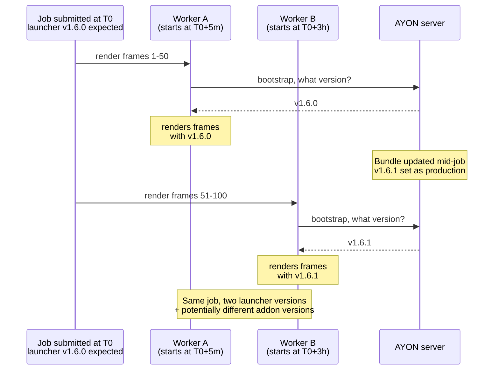
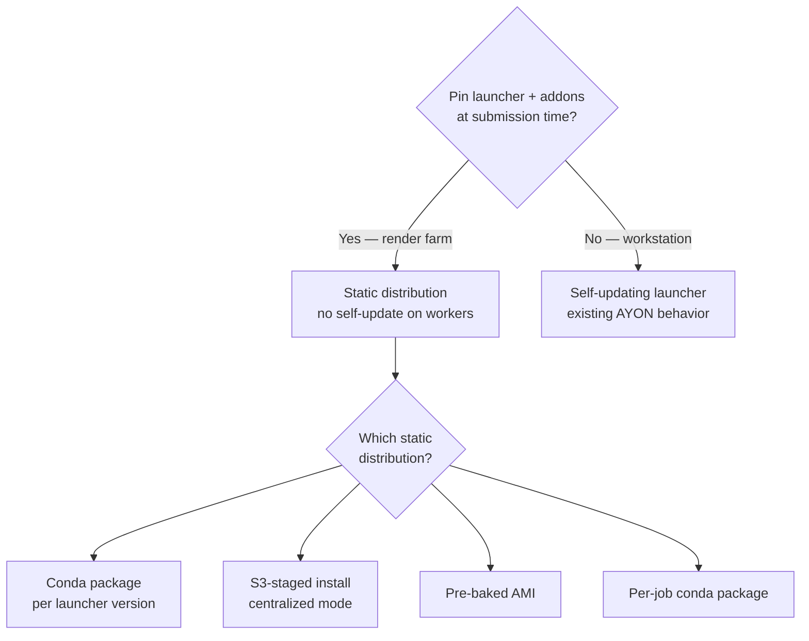
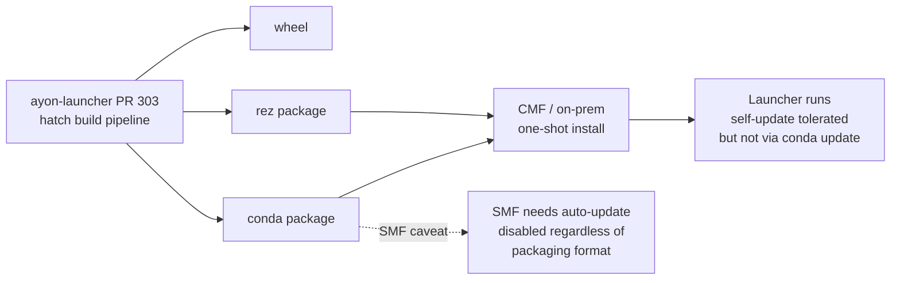
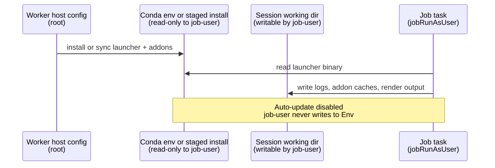
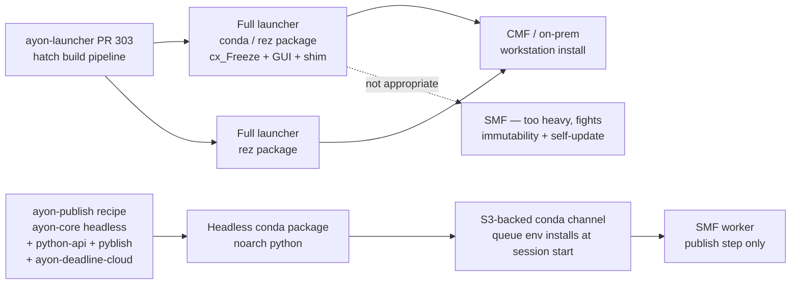

# AYON Launcher Distribution on Deadline Cloud Workers

> Working notes — exploring distribution paths for AYON Launcher on Deadline Cloud workers.
> Context: discussion in [wg-deadline-cloud thread](https://discord.com/channels/517362899170230292/1496527767217377430) and [ayon-launcher PR #303](https://github.com/ynput/ayon-launcher/pull/303).

> **Status (2026-06-12): rationale record — partially superseded.** This is the decision-rationale behind the [Runtime and Bundle Distribution](./design.md#runtime-and-bundle-distribution) section of `design.md` (rejected options, the conda-immutability and auto-update-determinism arguments, the SMF privilege model — all still valid). **However, its headline conclusion — ship a *separate slim headless `ayon-publish` package* to SMF — was NOT the path taken.** The 2026-06-09 Dev Deep Dive and Leon's [deadline-cloud-samples#237](https://github.com/aws-deadline/deadline-cloud-samples/pull/237) instead package the **full AYON Launcher** as a conda package and run it **headless** on SMF (one artifact for all fleet types; the per-studio bundle ships separately via job attachments). Read the reasoning below as the "why," but treat the headless-package conclusion as superseded by the full-Launcher decision.

## TL;DR

After thinking through it and seeing two parallel pieces of work converge:

- **Don't ship the full cx_Freeze'd AYON Launcher to SMF workers.** It's the wrong primitive — too big, fights conda's immutability, conflicts with self-update.
- **Ship a headless publish package instead.** A small, conda-installable Python package with just the code paths a worker needs (`ayon-core` headless, `ayon-python-api`, `pyblish-base`, the `ayon-deadline-cloud` addon). Pin its version at submission time.
- **Keep the full launcher (PR #303 conda/rez output) for CMF and on-prem.** That's where the GUI, shim, and self-update belong.

This is the shape Ondřej proposed and Leon independently prototyped. The rest of this doc is the reasoning that gets there.

## Two assumptions worth questioning

Before picking a packaging format, two assumptions baked into AYON Launcher's design need a second look in the render farm context:

### 1. Conda packages are immutable after install

Conda's contract is that `$CONDA_PREFIX/<pkg>` doesn't change between install and remove. AYON Launcher self-updates by writing into its own install tree. That's a conflict everywhere conda is involved — workstation, CMF, or SMF. It's not an SMF-specific problem.

What differs is *how loud the conflict is*:

| Environment | Why the conflict is louder or quieter |
|---|---|
| **Workstation / local install** | Quiet. User owns env, writes succeed. Conda's view of the package becomes inconsistent, but nobody runs `conda update ayon-launcher` on a workstation, so the inconsistency is invisible until someone tries. |
| **CMF on-prem** | Quiet. Studio controls perms and can grant write. Same latent inconsistency as workstation. Tolerated because studios manage launcher updates manually. |
| **SMF** | Loud. Job-user can't write to root-owned env. Self-update fails immediately with permission denied. |

So conda + AYON Launcher works *only if you treat conda as a one-shot installer and never run `conda update` on it.* That's a coherent stance, but worth being explicit about.

### 2. Auto-update is desirable on render workers

This is the bigger question and it's not really about packaging at all.

Auto-update on a workstation is great: artists always run the right launcher version for the project they open. But on a render farm, auto-update is **a determinism risk**.

What can go wrong:

- **Different launcher versions across workers in the same job.** Frames 1–50 run with v1.6.0 logic; frames 51–100 with v1.6.1. If addon resolution or publish behavior changed between versions, output drifts mid-sequence.
- **Different addon versions across workers.** Even with launcher pinned, if the active bundle is updated mid-job, addons resolved by later workers differ from earlier ones.
- **Re-renders aren't reproducible.** A frame re-render six months later picks up whatever version is current, not what produced the original.
- **Cold-start cost paid every time.** Auto-update means every worker session checks the server, possibly downloads, before doing useful work. On a Deadline Cloud session that's already paying 12+ minutes of overhead, this adds more.

The render farm wants the **opposite** of auto-update: pin the launcher version + addon versions at submission time, ship that exact set to every worker, and never let a worker resolve a different version mid-job.

This isn't an argument against auto-update on the launcher in general — it's an argument that **the render-farm code path should bypass auto-update entirely** and the distribution mechanism should support pinning.

## What changes if we drop auto-update on the farm

If the launcher on a worker doesn't try to mutate itself, the immutability problem with conda goes away. The packaging discussion gets a lot simpler.

## Distribution paths for the farm

```mermaid
flowchart TD
    Start[Render job submitted with<br/>pinned launcher + addon versions] --> FleetType{Fleet type?}

    FleetType -->|CMF / on-prem| CMFPath
    FleetType -->|SMF| SMFPath

    CMFPath[Studio controls host<br/>install once, no per-job overhead]
    CMFPath --> CMFConda[Conda or rez package<br/>installed system-wide]
    CMFPath --> CMFLocal[Plain on-prem install<br/>same as workstation]

    SMFPath{How to ship pinned bundle<br/>to ephemeral SMF workers?}
    SMFPath -->|A| PathA
    SMFPath -->|B| PathB
    SMFPath -->|C| PathC
    SMFPath -->|D| PathD

    subgraph PathA[Path A — Stable conda package + addon overlay]
        A1[Build conda package per launcher release]
        A1 --> A2[Publish to S3-backed conda channel]
        A2 --> A3[Queue env installs at session start]
        A3 --> A4[Job resolves addons from manifest<br/>passed via job parameters]
        A4 --> A5[Addons cached in writable session dir]
    end

    subgraph PathB[Path B — Per-job conda package]
        B1[Build step at job start<br/>creates conda package]
        B1 --> B2[Upload to per-job S3 location]
        B2 --> B3[Render and publish steps depend on build]
        B3 --> B4[Each worker installs the<br/>job-specific package]
    end

    subgraph PathC[Path C — S3-staged centralized mode]
        C1[Studio pre-stages launcher + addons<br/>per release in S3]
        C1 --> C2[Job parameter selects which staged<br/>version to use]
        C2 --> C3[Worker syncs from S3 at session start]
        C3 --> C4[AYON centralized mode reads<br/>from staged location]
    end

    subgraph PathD[Path D — Pre-baked AMI]
        D1[Custom AMI with launcher + tools]
        D1 --> D2[Worker boots with everything ready]
        D2 --> D3[Job verifies AMI version matches<br/>submission pin]
    end
```

## Path comparison

| Path | Reproducibility | Session overhead | Update cadence | Native to | Notes |
|------|----------------|------------------|----------------|-----------|-------|
| **A. Stable conda package + addon overlay** | Strong — addons pinned per job, launcher pinned per channel release | Low after first cache hit | Rebuild conda package per launcher release | Deadline Cloud | Cleanest split: rare-changing launcher vs frequent-changing addons |
| **B. Per-job conda package** | Strongest — full pin per submission | Medium-high — build + upload (hundreds of MB) per job | None needed; each job builds fresh | Deadline Cloud | Build cost on every submit, cache thrash, but truly hermetic |
| **C. S3-staged centralized mode** | Strong — pinned via studio's staging process | Low — S3 sync at session start | Studio re-stages per release | AYON | Matches AYON's existing centralized mode; sidesteps conda fight entirely |
| **D. Pre-baked AMI** | Strong — pinned per AMI | Zero | Rebake AMI per launcher release | AWS | Heavy ops burden if launcher versions move often; great for fixed configs |

## CMF / on-prem

CMF and on-prem aren't constrained the way SMF is. The conda or rez package from PR #303 is a fine fit *as a one-shot installer* — studio installs it system-wide, treats updates as "uninstall + install new package version," and never relies on the launcher self-updating in place.

If the studio wants self-update on CMF workers (because they update launcher versions out-of-band from job submissions), the conda/rez package can still be used, with the same caveat: don't run `conda update` on it.

## SMF privilege model — for reference

Even with auto-update disabled, the SMF privilege model still shapes which paths are viable. Worker host configuration runs as root and prepares the environment; job tasks run as `jobRunAsUser` without admin rights. Anything the job-user needs to write must land in a session-scoped, job-user-owned location.

## Open questions

1. Confirm: should auto-update be **disabled** on render workers, with launcher + addon versions pinned at submission?
2. Where does the studio's source-of-truth for "this job's launcher + addon set" live — AYON server bundle, S3 manifest, both?
3. Which SMF path is the right MVP target, and which is the long-term answer?
4. How does this interact with the existing render → publish split (SMF → CMF) agreed on for MVP?
5. Does AYON Launcher already have a "pinned mode" flag, or does that need to be added?

---

## Update — convergence on a headless publish package

> **Superseded (2026-06-12).** The convergence below favored a separate slim headless `ayon-publish` package for SMF. The 2026-06-09 call and [deadline-cloud-samples#237](https://github.com/aws-deadline/deadline-cloud-samples/pull/237) instead packaged the **full AYON Launcher** as a conda package and run it headless on SMF + CMF. The reasoning here (immutability, no self-update, read-only `$CONDA_PREFIX`) still applies to the full-Launcher package; the "tens of MB pure-Python" sizing and the separate-artifact framing do not. Kept for history.

After this doc went out, two things happened in close sequence in the wg-deadline-cloud thread:

**Ondřej's reframe:** *"Maybe we don't really need the whole launcher. Maybe we could simply extract part of it as standalone pip installable thing that will bootstrap AYON and its own version can be independent of both launcher and addons."*

**Leon's working prototype:** he had built a custom conda recipe (`ayon-publish` v1.9.5, noarch:python) that bundles `ayon-core` (headless), `ayon-python-api`, `pyblish-base`, `clique`, the `ayon_deadline_cloud` addon, and the dependencies needed to run `ayon addon deadline_cloud publish` on an SMF worker. He confirmed it works in the publish step.

These are the same idea from two angles. Ondřej is asking *"what's the right factoring of AYON for headless workers?"* Leon answered with a recipe.

### Why this collapses most of the SMF discussion above

| Concern raised earlier | How a headless publish package handles it |
|---|---|
| Conda immutability | Package never mutates itself — no self-update on workers |
| Auto-update determinism | Package version is the pin; bundle name + package version pin the publish-side code |
| SMF privilege model | Job-user only reads from `$CONDA_PREFIX`, writes go to session dir |
| cx_Freeze bundle size | Pure Python, tens of MB instead of hundreds |
| Shim and GUI complications | Not shipped to workers at all |

The four SMF paths (A/B/C/D) above were assuming we ship the full launcher to workers. Once we accept that workers only need the headless code paths, **Path A (stable conda + addon overlay)** is essentially what Leon built — just sliced finer than the full launcher.

### Refined picture

### Open items now narrower

1. Agree explicitly that the SMF target is a headless conda package, separate artifact from PR #303's full launcher package.
2. Decide ownership of the headless package recipe — does it live in `ynput/ayon-core`, `ynput/ayon-deadline-cloud`, or its own repo? Leon's prototype currently has hardcoded local paths and pins ayon-core 1.9.5 + addon by file copy.
3. Settle on dependency pinning strategy: pip-install with explicit versions (Leon's approach, defensible for a self-contained package) vs sourcing each component as a separate `source:` entry.
4. Cross-platform: Leon's wrapper is Linux-shaped. Windows fleets need a `bin\ayon.bat` equivalent.
5. How addons get pinned alongside the headless code — bake into the package (rebuild per addon update) vs pass via job parameters and stage from the AYON server.
