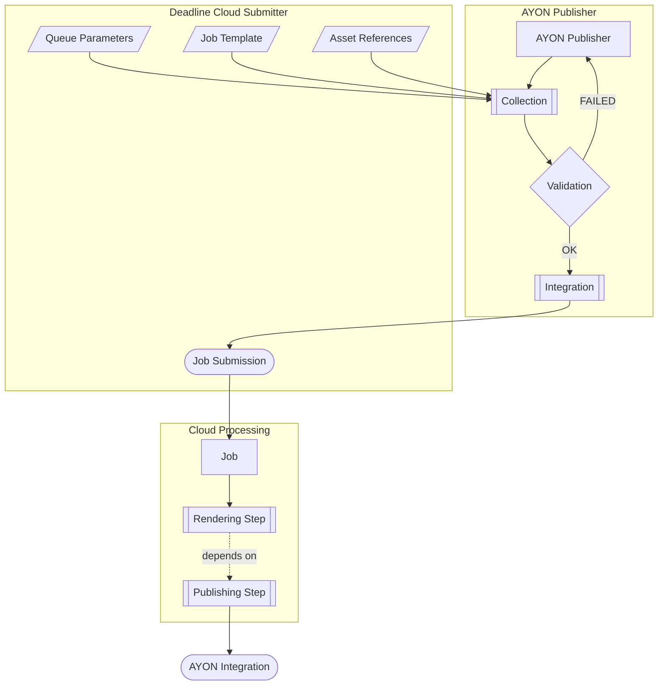

# AYON Addon for AWS Deadline Cloud Integration
This repository contains an [AYON](https://ynput.io/ayon/) addon for integration with [AWS Deadline Cloud](https://aws.amazon.com/deadline-cloud/).

It supports following features:
* Submitting render jobs from Maya, Nuke, Houdini and Blender
* Publishing renders to AYON

## Requirements
- Deadline Cloud submitters must be available in target DCCs (AYON Tools environments can be used to set them).
- Deadline Cloud credentials must be configured on every machine used for submission.
- Farm and queue IDs must be set either in Deadline Cloud configuration or in AYON addon settings.
- A CMF fleet must be configured for the publishing worker. For details, see [Current implementation of publishing step](#current-implementation-of-publishing-step).
  - AYON Launcher must be available and present in `PATH`.
  - The machine must be able to connect to the AYON server instance.
  - The machine must be able to access the studio file system as an artist machine would (to integrate products).
  - Proper host requirement attributes must be set to differentiate publishing machines from render machines.
  - The machine must be able to skip default Conda environment creation.

## Setup Guide
### Install the addon
Use the AYON Addon Market, or clone, build, and upload the addon manually:

```sh
git clone --depth 1 https://github.com/ynput/ayon-deadline-cloud
cd ayon-deadline-cloud
python -X dev ./create_package.py
```

Upload the resulting ZIP file from the `./packages` folder to your AYON instance. Restart the server and associate the addon with the bundle you want to use.

### Configure the addon
In AYON, open the AWS Deadline Cloud settings. You can keep default values, but then you must configure Deadline Cloud Farm ID and Queue ID in Deadline Cloud submitter settings. Note the Publish Host Requirement Roles (or change them accordingly), because they are required in later steps.

### Install Deadline Cloud submitters
For submitter installation, refer to [the official documentation](https://docs.aws.amazon.com/deadline-cloud/latest/userguide/submitter.html).

> [!NOTE]
> For now, you need to use AYON specific forks until the code is merged upstream.
> - Maya: https://github.com/ynput/deadline-cloud-for-maya
> - Houdini: https://github.com/ynput/deadline-cloud-for-houdini
> - Nuke: https://github.com/ynput/deadline-cloud-for-nuke
> - Blender: https://github.com/ynput/deadline-cloud-for-blender

You can use AYON tools to configure submitters for AYON-managed applications. In the AYON Applications addon, create a new definition at `ayon+settings://applications/tool_groups` per host with environments like this (example for Nuke):

```json
{
  "NUKE_PATH": [
    "{NUKE_PATH}",
    "C:\\software\\deadline-cloud-for-nuke\\src"
  ],
  "PYTHONPATH": [
    "{PYTHONPATH}",
    "C:\\software\\deadline-cloud\\src"
  ],
  "DEADLINE_ENABLE_DEVELOPER_OPTIONS": "true"
}
```

### Handle Deadline Cloud credentials
AYON does not manage Deadline Cloud authentication. Configure authentication for your users using one of the supported methods.

[Managing users in Deadline Cloud](https://docs.aws.amazon.com/deadline-cloud/latest/userguide/managing-users.html)

### Set up your farm
You can configure the farm based on your needs, but publishing requires additional setup.

#### Fleets
For rendering, [SMF](#terminology) is sufficient. For publishing, create a [CMF](#terminology) with at least one machine dedicated to publishing (or use your own machines for both rendering and publishing with role separation).

### Queue and environment
If you use the same queue for rendering and publishing, disable Conda environment creation on the CMF publishing machine by modifying [this environment](https://github.com/aws-deadline/deadline-cloud-samples/blob/mainline/queue_environments/conda_queue_env_inline.yaml).

In AWS Console go to Deadline Cloud Dashboard, click on the farm, select your Queue and then go to *Queue environments* tab. There, you can edit the environment file directly in the browser.

The goal is to not run `conda create --yes --quiet ...` on publish workers.

For example, set an environment variable `DISABLE_CONDA_ENV` on the publishing machine to exit early from Conda setup with something like:
```sh
if [ -v DISABLE_CONDA_ENV ]; then
    echo "Disabling Conda."
    exit 0
fi
```
Or you can do something more sophisticated, based on your setup and needs.

### Host Requirements
To prevent publishing on SMF render machines (where AYON is not available) and rendering on CMF publishing machines, configure Host Requirements using the roles from [Configure the addon](#configure-the-addon).

You can do it per Fleet on Deadline Cloud Dashboard in AWS Console - Select your farm, go to the Fleet tab, select your CMF fleet and
go to the *Worker capabilities* tab. You can add `attr.role` with the value defined in addon settings in the *Custom worker capabilities* section there.

Set the `attr.role` attribute to `render` or `publish` (or your custom role names):
- On the whole SMF fleet (AWS Console) set `render`
- On a specific machine in Deadline Cloud worker agent configuration This can be done on the specific machine by editing the configuration file. This file can be found usually on `/etc/amazon/deadline/worker.toml` - [more information about Deadline Cloud worker agent configuration](https://github.com/aws-deadline/deadline-cloud-worker-agent/blob/release/docs/configuration.md)

### Storage profiles
Configure storage profiles to match the path roots defined by your project/studio Anatomy. So if your roots look like this:
```json
{
    "windows": "P:\\projects",
    "linux": "/mnt/share/projects",
    "darwin": "/Volumes/projects"
}
```
You need to create platform specific profiles, something like:

| Platform | Path Name | Type | Location Path |
| --- | --- | --- | --- |
| Linux | projectsDrive | SHARED | /mnt/projects |
| Windows | projectsDrive | SHARED | P:\\projects |

### Publishing worker machine
To set up the worker machine, [follow this guide](https://docs.aws.amazon.com/deadline-cloud/latest/developerguide/worker-host.html).

For publishing, install AYON Launcher and make it available in `PATH` for the user running the jobs. Use `AYON_SERVER_URL` and `AYON_API_KEY` environment variables to configure access to the AYON server instance. Ensure the machine can access all project Anatomy roots. [Setup](#host-requirements) the host requirements on that machine if needed.

## Design

### Terminology
- **CMF**: [Customer-managed Fleet](https://docs.aws.amazon.com/deadline-cloud/latest/userguide/manage-cmf.html). A fleet fully managed by the studio. Machines can run on-prem or in the cloud. They connect to Deadline Cloud via the [Deadline Cloud worker agent](https://docs.aws.amazon.com/deadline-cloud/latest/developerguide/run-worker.html) running as a service.
- **SMF**: [Service-managed Fleet](https://docs.aws.amazon.com/deadline-cloud/latest/userguide/smf-manage.html). A cloud worker fleet with default Deadline Cloud settings designed for efficiency and cost-effectiveness.
- **Publishing**: AYON concept of creating a product version (for example a model or a render). More broadly, it is a publishing process with checks and validations. In Deadline Cloud context, publishing is used both for job submission (to collect and validate data) and for automated product version creation in AYON after job completion.

### Dataflow
When an AYON-enabled DCC launches, the Publisher tool is available. The artist creates a Deadline Cloud instance to mark the scene for publishing. The selected options are translated into OpenJD template data and parameters.

When publishing starts, the collection phase asks the Deadline submitter for all required data, such as queue parameters, the job template, parameter values, and asset references. It overrides any values by values set by the artist in Publisher settings.

The publishing step is then injected into the job template. See [Current implementation of publishing step](#current-implementation-of-publishing-step).

After collection, validation runs. This can include checks for render settings, scene parameters, AYON context, and studio-specific custom validations.

If validation fails, the artist is shown an error summary and, in some cases, options to run semi-automated repairs. Then publishing starts again.

If validation succeeds, the integration phase writes required files in YAML format and prepares a job bundle that is submitted using the Deadline Cloud Python API. During submission, another validation pass occurs (for example OpenJD schema validation).

The job is submitted with two steps: rendering and publishing. The publishing step depends on rendering. Once rendering is done, publishing runs AYON Publisher on the results and produces a version registered in AYON. During publishing, review videos can be generated and color transcoding can occur, depending on studio configuration.



## Current implementation of publishing step
### Overview
The publishing step currently relies heavily on worker machines having [AYON Launcher](https://github.com/ynput/ayon-launcher) available and able to connect to AYON server. This currently limits publishing to CMF fleets, because AYON Launcher is not available as a conda or rez package, and is not pip-installable yet (therefore not available on SMF).

Another hard requirement is that the publishing worker machine must be able to access the studio file system to move resulting products to their final destination.

A few constraints make this process more complex:
- The default Deadline Cloud queue environment installs Conda packages, but those are not available on CMF publishing machines.
- The publishing machine may be different from render machines.
- There is no straightforward built-in way to classify some machines as render workers and others as publishing workers.

### Setup
To prevent publishing on render machines (where AYON or studio filesystem access may not be available) and rendering on publishing machines (where Conda render packages may not be available), this integration uses role-based Host Requirements.

With [HostRequirements](https://docs.aws.amazon.com/deadline-cloud/latest/developerguide/build-job-limits.html), render machines are labeled `attr.role = render` and publishing machines `attr.role = publish`. These requirements are assigned to the corresponding steps.

The queue environment uses [the default sample](https://github.com/aws-deadline/deadline-cloud-samples/blob/mainline/queue_environments/conda_queue_env_inline.yaml) with a small modification near the top:

```sh
if [ -v DISABLE_CONDA_ENV ]; then
    echo "Disabling Conda."
    exit 0
fi
```

Set this environment variable on publishing machines to skip Conda setup there.

The `role` attribute can be set either on a specific machine (in Deadline Cloud worker agent config) or directly on the CMF fleet.

### Publishing
Publishing is performed by AYON. Required information is passed from the job to AYON Launcher via a publish manifest. AYON discovers rendered sequences, creates publishing instances with correct representations, and passes those to other publishing plugins that generate reviewables, thumbnails, and other outputs defined by studio workflows.

At the end of publishing, outputs are renamed according to studio conventions defined in Anatomy templates and moved to final destinations.

### Details
Files generated by rendering steps are synchronized through S3 to the publishing machine. AYON Launcher must be in `PATH`, and it must be able to connect to the correct AYON server and access the studio file system using roots defined in project Anatomy, effectively like running on an artist workstation in the studio.

The publishing context is serialized at submission time into a versioned JSON manifest (`ayon_publish_manifest.json`) which is attached to the job and referenced by the `ayonPublishData` job parameter of type `PATH`. Only two command-line arguments are passed to the publish step:
- `publish-data` - path to the manifest, remapped by Deadline Cloud
- `path-mapping-file` - session path mapping rules

The manifest carries `projectName`, `folderPath`, `taskName`, `userName`, `hostName`, `productBaseType`, `variant`, `sourceFile` and `outputPath`.

> [!NOTE]
> About path mapping: only the manifest location itself is remapped by Deadline Cloud. Paths *stored inside* the manifest (for example `outputPath`) are not, because declaring them as `PATH` conflicts with an OpenJD requirement that all paths must be relative to the job bundle. For that reason, AYON performs its own simple remapping using the provided path mapping file based on storage profiles associated with the fleet/farm.

When publishing starts, AYON runs a collector plugin that scans files in the specified directory. For each sequence found, it creates a new product instance. For non-sequence files, it creates one product and stores them as separate representations.

## Known issues

## General
- The addon requires Deadline Cloud submitters to be installed, but it currently cannot install them or gracefully validate their presence.
- Missing support for non-image data (for example caches).

### Submission
- Missing validator for referenced assets.
- Not all template data types are handled correctly by Publisher attributes.
- Nuke: multiple write nodes are not supported (all or one).

### Publishing step
- Runs only on preconfigured CMF machines with AYON server access and studio filesystem access:
     - AYON Launcher as a Conda/Rez/Python [ynput/ayon-deadline-cloud#7]
     - Sync published results from S3 bucket to studio [ynput/ayon-deadline-cloud#20]
- Uses preconfigured user credentials. [ynput/ayon-deadline-cloud#21]
- Cannot handle single-frame sequences. [ynput/ayon-deadline-cloud#22]
- Missing additional publishing metadata (for example color management data, review tags). [ynput/ayon-deadline-cloud#22]
- No simple failure feedback path (other than inspecting logs in Deadline Monitor).
- Path remapping should ideally be handled entirely by Deadline Cloud. [ynput/ayon-deadline-cloud#23]
- Frame-range resolution is derived from parent entity or representation length, and cannot handle multiple representations with different lengths. [ynput/ayon-deadline-cloud#22]
